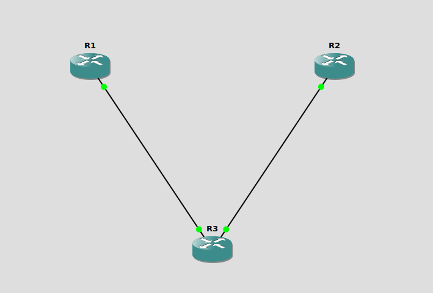

# Infrastructure as Code with Terraform

## Terraform

> **Terraform** is an infrastructure as code tool that lets you build, change, and version cloud and on-prem resources safely and efficiently. HashiCorp Terraform is an infrastructure as code tool that lets you define both cloud and on-prem resources in human-readable configuration files that you can version, reuse, and share. You can then use a consistent workflow to provision and manage all of your infrastructure throughout its lifecycle. ([developer.hashicorp.com](https://developer.hashicorp.com/terraform/intro?utm_source=chatgpt.com))

**How it’s used:**

1. **Write** HashiCorp Configuration Language (HCL) files to declare `providers` and `resources`.
2. Run `terraform init` to initialize the directory and install provider plugins. ([developer.hashicorp.com](https://developer.hashicorp.com/terraform/cli/commands/init?utm_source=chatgpt.com))
3. Run `terraform plan` to preview changes Terraform will make. ([developer.hashicorp.com](https://developer.hashicorp.com/terraform/tutorials/cli/plan?utm_source=chatgpt.com))
4. Run `terraform apply` to enact the plan, creating, updating, or destroying resources. ([developer.hashicorp.com](https://developer.hashicorp.com/terraform/cli/commands/apply?utm_source=chatgpt.com))
5. Manage state (`terraform.tfstate`), optionally using remote backends for collaboration and locking.

### Example Usage

#### GNS3 Official Installation Guides

In order to get the real gist of network automation always have containerlab, cisco packet tracer and gns3 with some cisco router template or any router installed. The following link will help you setup gns3 on your local machine

* **General Getting Started & Installation Overview**
  [https://docs.gns3.com/docs/getting-started/installation](hhttp://docs.gns3.com/docs/) 

* **Windows Installation**
  [https://docs.gns3.com/docs/getting-started/installation/windows/](https://docs.gns3.com/docs/getting-started/installation/windows/) 

* **macOS Installation**
  [https://docs.gns3.com/docs/getting-started/installation/mac/](https://docs.gns3.com/docs/getting-started/installation/mac/) 
* **Ubuntu/Linux Installation**
  [https://docs.gns3.com/docs/getting-started/installation/linux/](https://docs.gns3.com/docs/getting-started/installation/linux/) 

* **Remote Server Installation**
  [https://docs.gns3.com/docs/getting-started/installation/remote-server/](https://docs.gns3.com/docs/getting-started/installation/remote-server/) 

* **GNS3 VM Setup Wizard**
  [https://docs.gns3.com/docs/getting-started/setup-wizard-gns3-vm/](https://docs.gns3.com/docs/getting-started/setup-wizard-gns3-vm/) 

#### Terraform Provider for GNS3

**Overview**  
The Terraform Provider for GNS3 enables you to manage your GNS3 network emulation topologies as code. With this provider, you can create projects, instantiate routers, switches, clouds, and links entirely via Terraform—bringing the benefits of Infrastructure as Code (IaC) to your lab and testing environments. :contentReference[oaicite:0]{index=0}

---

#### Key Features

- **Project Management**: Create and configure GNS3 projects (`gns3_project`).  
- **Node Resources**: Instantiate and manage routers, switches, and cloud nodes directly from templates (`gns3_template`, `gns3_switch`, `gns3_cloud`).  
- **Link Automation**: Define network links between nodes declaratively (`gns3_link`).  
- **Lifecycle Actions**: Start or stop all nodes within a project (`gns3_start_all`). :contentReference[oaicite:1]{index=1}

Today we will be deploying a cisco (c7200) router on gns3 using template resource. Create main.tf in a new Directory.

```hcl
terraform {
  required_providers {
    gns3 = {
      source  = "netopschic/gns3"
      version = "2.4.0"
    }
  }
}

provider "gns3" {
  host = "http://localhost:3080"
}

# Lookup the Cisco 7200 template ID
data "gns3_template_id" "router" {
  name = "c7200"
}

# Create a GNS3 Project
resource "gns3_project" "project1" {
  name = "cisco-topology"
}

# Instantiate three routers from the template
resource "gns3_template" "r1" {
  name        = "R1"
  project_id  = gns3_project.project1.project_id
  template_id = data.gns3_template_id.router.template_id
  compute_id  = "local"
  x           = -200
  y           = -100
}

resource "gns3_template" "r2" {
  name        = "R2"
  project_id  = gns3_project.project1.project_id
  template_id = data.gns3_template_id.router.template_id
  compute_id  = "local"
  x           =  200
  y           = -100
}

resource "gns3_template" "r3" {
  name        = "R3"
  project_id  = gns3_project.project1.project_id
  template_id = data.gns3_template_id.router.template_id
  compute_id  = "local"
  x           =    0
  y           =  200
}

# Link each router to each other (full mesh)
resource "gns3_link" "r1_r2" {
  project_id     = gns3_project.project1.project_id
  node_a_id      = gns3_template.r1.id
  node_a_adapter = 1
  node_a_port    = 0
  node_b_id      = gns3_template.r2.id
  node_b_adapter = 1
  node_b_port    = 0
}

resource "gns3_link" "r2_r3" {
  project_id     = gns3_project.project1.project_id
  node_a_id      = gns3_template.r2.id
  node_a_adapter = 1
  node_a_port    = 0
  node_b_id      = gns3_template.r3.id
  node_b_adapter = 1
  node_b_port    = 0
}

resource "gns3_link" "r3_r1" {
  project_id     = gns3_project.project1.project_id
  node_a_id      = gns3_template.r3.id
  node_a_adapter = 1
  node_a_port    = 0
  node_b_id      = gns3_template.r1.id
  node_b_adapter = 1
  node_b_port    = 0
}

# Start all three routers once they are created
resource "gns3_start_all" "start_routers" {
  project_id = gns3_project.project1.project_id
  depends_on = [
    gns3_template.r1,
    gns3_template.r2,
    gns3_template.r3,
  ]
}

```

```bash
terraform init
```
### Terraform Workflow: init → plan → apply

Terraform follows a simple three-step workflow to take your HCL configuration files and turn them into real infrastructure:

---

#### 1. `terraform init`

**What it does:**

* Initializes your working directory for Terraform.
* Downloads and installs provider plugins declared in `required_providers`.
* Sets up the backend for state storage (local file or remote).
* Retrieves any modules you’ve referenced.

**When to run:**

* First time in a new directory.
* After adding or changing providers or modules.

**Example:**

```bash
cd my-terraform-project/
terraform init
```

**Key output:**

* “Initializing the backend…”
* “Initializing provider plugins…”
* Summary of installed plugins and backend details.

---

#### 2. `terraform plan`

**What it does:**

* Reads current state (`terraform.tfstate` or remote).
* Queries real infrastructure to refresh state.
* Compares your HCL with actual state to calculate changes.
* Outputs a **plan** showing resources to create (`+`), modify (`~`), or destroy (`-`).

**When to run:**

* Before applying changes, to verify desired outcome.

**Example:**

```bash
terraform plan \
  -out=changes.tfplan
```
```bash
data.gns3_template_id.router: Reading...
data.gns3_template_id.router: Read complete after 0s [id=6dc0dd4c-aec2-4818-98a8-3b12a4410119]

Terraform used the selected providers to generate the following execution plan. Resource actions are indicated with the following
symbols:
  + create

Terraform will perform the following actions:

  # gns3_link.r1_r2 will be created
  + resource "gns3_link" "r1_r2" {
      + id             = (known after apply)
      + link_id        = (known after apply)
      + node_a_adapter = 1
      + node_a_id      = (known after apply)
      + node_a_port    = 0
      + node_b_adapter = 1
      + node_b_id      = (known after apply)
      + node_b_port    = 0
      + project_id     = (known after apply)
    }

  # gns3_link.r2_r3 will be created
  + resource "gns3_link" "r2_r3" {
      + id             = (known after apply)
      + link_id        = (known after apply)
      + node_a_adapter = 1
      + node_a_id      = (known after apply)
      + node_a_port    = 0
      + node_b_adapter = 1
      + node_b_id      = (known after apply)
      + node_b_port    = 0
      + project_id     = (known after apply)
    }

  # gns3_link.r3_r1 will be created
  + resource "gns3_link" "r3_r1" {
      + id             = (known after apply)
      + link_id        = (known after apply)
      + node_a_adapter = 1
      + node_a_id      = (known after apply)
      + node_a_port    = 0
      + node_b_adapter = 1
      + node_b_id      = (known after apply)
      + node_b_port    = 0
      + project_id     = (known after apply)
    }

  # gns3_project.project1 will be created
  + resource "gns3_project" "project1" {
      + id         = (known after apply)
      + name       = "cisco-topology"
      + project_id = (known after apply)
    }

  # gns3_start_all.start_routers will be created
  + resource "gns3_start_all" "start_routers" {
      + id         = (known after apply)
      + project_id = (known after apply)
    }

  # gns3_template.r1 will be created
  + resource "gns3_template" "r1" {
      + compute_id  = "local"
      + id          = (known after apply)
      + name        = "R1"
      + project_id  = (known after apply)
      + start       = false
      + template_id = "6dc0dd4c-aec2-4818-98a8-3b12a4410119"
      + x           = -200
      + y           = -100
    }

  # gns3_template.r2 will be created
  + resource "gns3_template" "r2" {
      + compute_id  = "local"
      + id          = (known after apply)
      + name        = "R2"
      + project_id  = (known after apply)
      + start       = false
      + template_id = "6dc0dd4c-aec2-4818-98a8-3b12a4410119"
      + x           = 200
      + y           = -100
    }

  # gns3_template.r3 will be created
  + resource "gns3_template" "r3" {
      + compute_id  = "local"
      + id          = (known after apply)
      + name        = "R3"
      + project_id  = (known after apply)
      + start       = false
      + template_id = "6dc0dd4c-aec2-4818-98a8-3b12a4410119"
      + x           = 0
      + y           = 200
    }

Plan: 8 to add, 0 to change, 0 to destroy.
```

**Key output:**

* “Terraform will perform the following actions:”
* A color-coded list of resource actions.
* A summary: “Plan: 3 to add, 1 to change, 0 to destroy.”

---

#### 3. `terraform apply`

**What it does:**

* Takes an execution plan (new or saved).
* Prompts for confirmation (optional: `-auto-approve`).
* Provisions, updates, or tears down resources in dependency order.

**When to run:**

* After reviewing and approving your plan.

**Examples:**

```bash
# Apply fresh plan in-memory
terraform apply
```
```bash
gns3_project.project1: Creating...
gns3_project.project1: Creation complete after 0s [id=11a4dd9c-9b52-4341-9355-4f8e789c224e]
gns3_template.r1: Creating...
gns3_template.r3: Creating...
gns3_template.r2: Creating...
gns3_template.r3: Creation complete after 0s [id=a2e6ea15-8c15-49c7-b63d-f086716f3318]
gns3_template.r2: Creation complete after 0s [id=2fc90300-d2e3-4ab7-9934-0d0b938712d8]
gns3_link.r2_r3: Creating...
gns3_template.r1: Creation complete after 0s [id=1f0c71dd-96ed-459b-b1de-996de5dc9050]
gns3_start_all.start_routers: Creating...
gns3_link.r3_r1: Creating...
gns3_link.r1_r2: Creating...
gns3_start_all.start_routers: Creation complete after 1s [id=11a4dd9c-9b52-4341-9355-4f8e789c224e-start]
gns3_link.r1_r2: Creation complete after 1s [id=04e36dee-a571-474f-816c-6d59ce51d1f8]
gns3_link.r3_r1: Creation complete after 1s [id=f03d6a5c-51a3-41a5-90d1-14335e3c1340]
gns3_link.r2_r3: Creation complete after 1s [id=8f0ca331-e663-492d-b8ac-4cefdf3d154c]

Apply complete! Resources: 8 added, 0 changed, 0 destroyed
```
<div align="center">
  
</div>

**Key output:**

* Progress logs for each resource action.
* Final summary: “Apply complete! Resources: +3 added, \~1 changed, -0 destroyed.”


## Challenge

1. Create an EC2 instance using terraform
2. Create an s3 bucket using terraform

## References

* Official Terraform Documentation: [https://developer.hashicorp.com/terraform/intro](https://developer.hashicorp.com/terraform/intro)
* Official OpenTofu Website: [https://opentofu.org/](https://opentofu.org/)
- GitHub Repository: https://github.com/NetOpsChic/terraform-provider-gns3  
