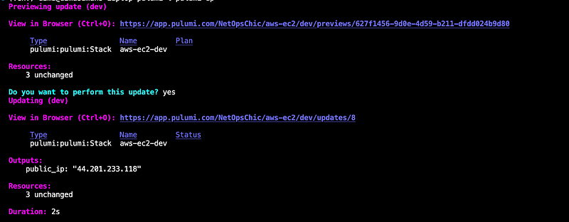

# Infrastructure as Code with Pulumi

Pulumi is a modern infrastructure as code (IaC) platform that allows you to define, deploy, and manage cloud resources using general-purpose programming languages such as Python, JavaScript, TypeScript, Go, .NET, and Java. It combines the power of imperative programming with the benefits of declarative infrastructure definitions. ([pulumi.com](https://www.pulumi.com/docs/iac/get-started/?utm_source=chatgpt.com), [pulumi.com](https://www.pulumi.com/docs/?utm_source=chatgpt.com))

## How Pulumi Is Used

1. **Install the Pulumi CLI**:

   ```bash
   curl -fsSL https://get.pulumi.com | sh
   ```
2. **Initialize a New Project**:

   ```bash
   pulumi new aws-python  # Choose your language and cloud
   ```
3. **Write Code**:
   Use your language of choice to import Pulumi libraries and define resources.
4. **Configure**:
   `pulumi config set aws:region us-west-2`
5. **Preview Changes**:

   ```bash
   pulumi preview
   ```
6. **Deploy**:

   ```bash
   pulumi up
   ```
7. **Manage State**:
   Pulumi stores state in the Pulumi Service by default or in your preferred backend (S3, Azure Blob, etc.).

## Example: Provision an AWS EC2 Instance (Python)

```python
"""A Python Pulumi program"""

import pulumi
from pulumi_aws import ec2

# Define a Security Group
security_group = ec2.SecurityGroup(
    'web-sg',
    description='Enable SSH and HTTP access',
    ingress=[
        ec2.SecurityGroupIngressArgs(
            protocol="tcp",
            from_port=22,
            to_port=22,
            cidr_blocks=["0.0.0.0/0"],  # Allow SSH access
        ),
        ec2.SecurityGroupIngressArgs(
            protocol="tcp",
            from_port=80,
            to_port=80,
            cidr_blocks=["0.0.0.0/0"],  # Allow HTTP access
        ),
    ]
)

# Create an EC2 instance
ami_id = "ami-005fc0f236362e99f"  # Update with a valid Ubuntu AMI for your region
instance = ec2.Instance(
    'ubuntu-instance',
    instance_type="t2.micro",
    ami=ami_id,
    vpc_security_group_ids=[security_group.id],
    key_name="",  # Replace with your AWS key pair
    tags={
        "Name": "PulumiInstance"
    }
)

# Export the public IP of the instance
pulumi.export("public_ip", instance.public_ip)
```

The output is something like this:

<div align="center">
  
</div>

---
## Challenge

1. Use Pulumi to deploy other AWS/GCP service

## References

* Pulumi Docs: [https://www.pulumi.com/docs/](https://www.pulumi.com/docs/) ([pulumi.com](https://www.pulumi.com/docs/?utm_source=chatgpt.com))
* AWS EC2 Example (TypeScript reference): [https://www.pulumi.com/docs/iac/clouds/aws/guides/more/#create-an-ec2-instance](https://www.pulumi.com/docs/iac/clouds/aws/guides/more/#create-an-ec2-instance) ([pulumi.com](https://www.pulumi.com/docs/iac/clouds/aws/guides/more/?utm_source=chatgpt.com))
