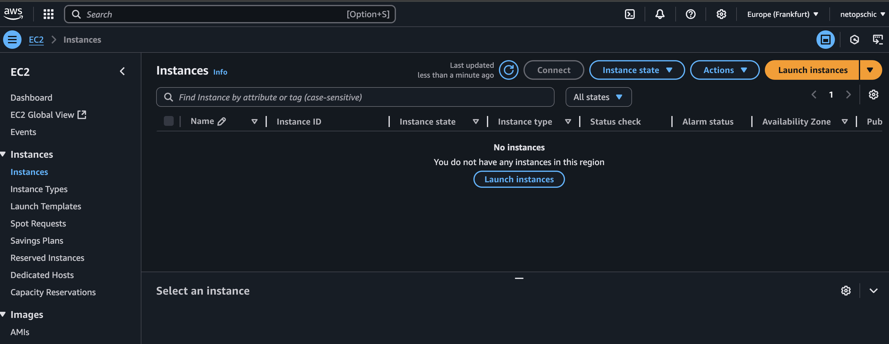
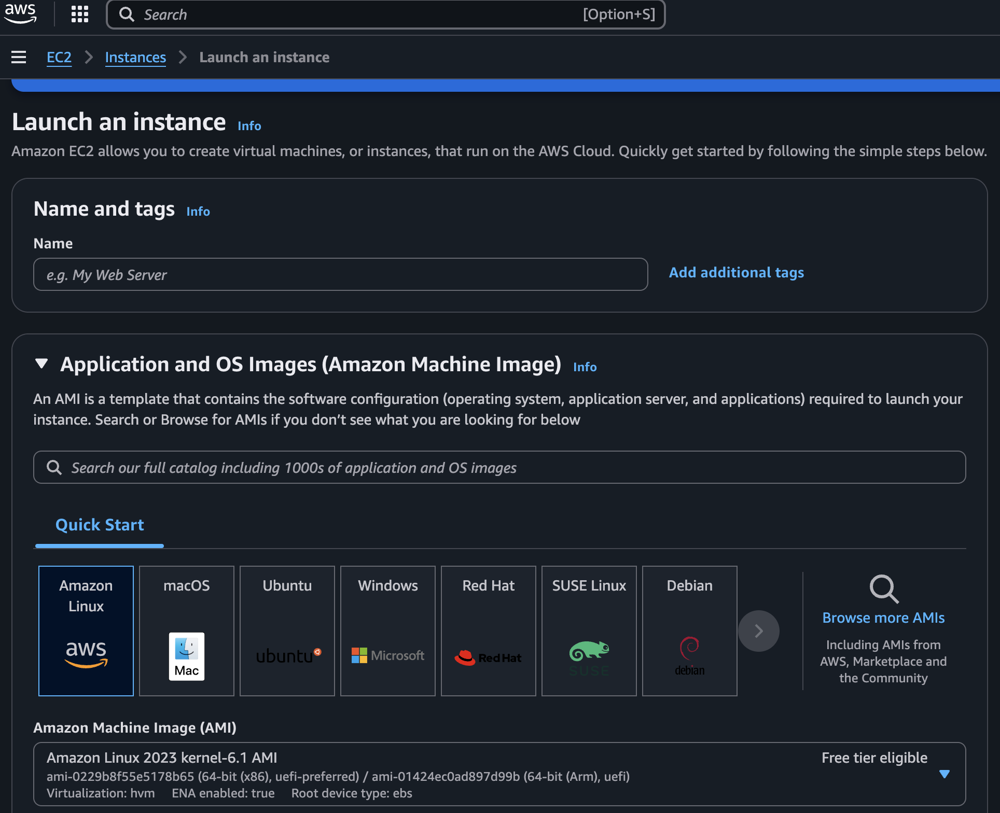
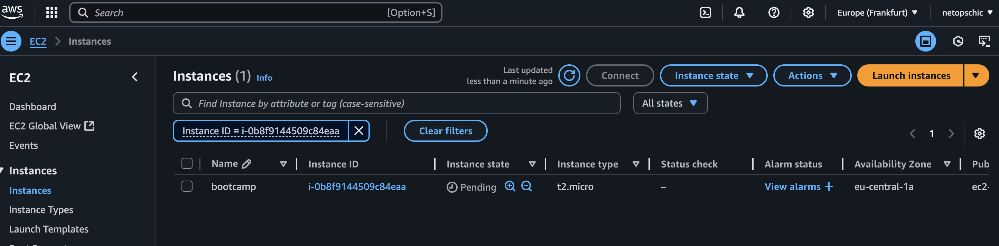
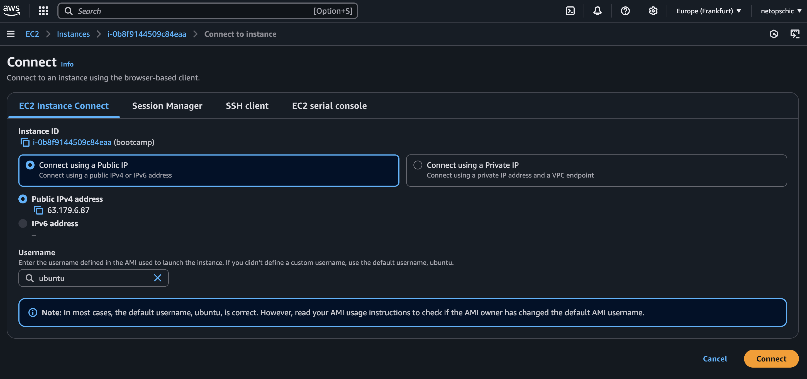

# Launching an EC2 Instance on AWS

This guide walks you through the basic steps to launch an EC2 instance using the AWS Management Console.

Imagine this service as creating a Virtual Machine on a server/hardware somehwere far away. 

There are many "sizes" of Instance depends on the usecase

| **Family**         | **Optimized For**              | **Examples**               | **Use Cases**                                     |
| ------------------ | ------------------------------ | -------------------------- | ------------------------------------------------- |
| **t (T series)**   | General Purpose (Burstable)    | t2.micro, t3.medium        | Low-traffic web servers, dev/test environments    |
| **m (M series)**   | General Purpose (Balanced)     | m5.large, m6i.xlarge       | Small/medium databases, app servers               |
| **c (C series)**   | Compute-Optimized              | c5.large, c6g.xlarge       | High-performance compute tasks, gaming, analytics |
| **r (R series)**   | Memory-Optimized               | r5.large, r6i.xlarge       | In-memory databases, big data, caching            |
| **x (X series)**   | Extra Memory-Optimized         | x2idn.16xlarge, x1e.xlarge | SAP HANA, in-memory analytics                     |
| **g / p / inf**    | Accelerated Computing (GPU/ML) | g4dn.xlarge, p3.2xlarge    | Machine learning, video rendering                 |
| **d / h / i / im** | Storage-Optimized              | i3.large, d2.xlarge        | Data warehousing, high IOPS workloads             |
| **z (Z series)**   | High Compute + High Memory     | z1d.large                  | Electronic design automation, HPC                 |

---
Here's a table comparing EC2 purchasing options, including On-Demand, Reserved, Spot, and Dedicated Hosts/Instances, to help you understand the differences clearly:

| **Type**                | **Description**                                                                 | **Billing**                 | **Use Case**                                    | **Savings Potential** |
| ----------------------- | ------------------------------------------------------------------------------- | --------------------------- | ----------------------------------------------- | --------------------- |
| **On-Demand**           | Pay by the second/minute with no commitment                                     | Per-second/minute billing   | Short-term, unpredictable workloads             | None (baseline price) |
| **Reserved Instances**  | Commit to 1 or 3 years for a lower hourly rate                                  | Upfront + hourly/monthly    | Steady-state or predictable workloads           | Up to 72%             |
| **Spot Instances**      | Bid on unused EC2 capacity (can be terminated anytime)                          | Per-second billing          | Fault-tolerant, batch jobs, stateless workloads | Up to 90%             |
| **Dedicated Hosts**     | Physical server dedicated to your use (control over sockets/cores/VM placement) | Per-host hourly billing     | Software licensing, regulatory compliance       | Varies                |
| **Dedicated Instances** | Run on hardware dedicated to a single customer                                  | Per-instance billing        | Isolation, security-sensitive applications      | Similar to On-Demand  |
| **Savings Plans**       | Flexible pricing model for compute usage with commitment (not tied to instance) | Per-usage (discounted rate) | Broad workloads across EC2, Fargate, Lambda     | Up to 66%             |

Now lets create a small EC2 instance just to get an idea

## Step 1: Log in to AWS Console
- Go to [https://console.aws.amazon.com/](https://console.aws.amazon.com/)
- Sign in with your AWS account credentials

---

## Step 2: Navigate to EC2 Dashboard
- In the AWS search bar, type `EC2`
- Click on **EC2** to open the EC2 Dashboard

---

## Step 3: Launch Instance
- Click the **Launch instance** button

---

## Step 4: Configure Instance
- Name: `MyFirstEC2`
- AMI: Select **Amazon Linux 2**
- Instance type: **t2.micro** (Free Tier eligible)
- Key pair: Create new or select existing
- Network settings: Allow SSH (port 22)

---

## Step 5: Launch the Instance
- Click **Launch Instance**
- Wait until status shows **running**

---

## Step 6: Connect to EC2
- Select the instance
- Click **Connect**
- Follow SSH instructions (example: `ssh -i my-key.pem ec2-user@<public-ip>`)

There are many ways to connect to to instance and start using it. IT depends on the situation for example in most of the SSHing into the instance is optimal but in some case that option is not available so one can go ahead with session manager

# Challenge

Create an Ubuntu istance and install basic packages into it.

# Final ToDo

Post about your journey, what you learned on different platforms like LinkedIn, Twitter or any other of your favourite platforms. Follow up on your journey and share it with others! Use the Hashtags #NetAutoBootcamp #NetworkAutomation
You can also tag us on LinkedIn with @netauto-group-rheinmain