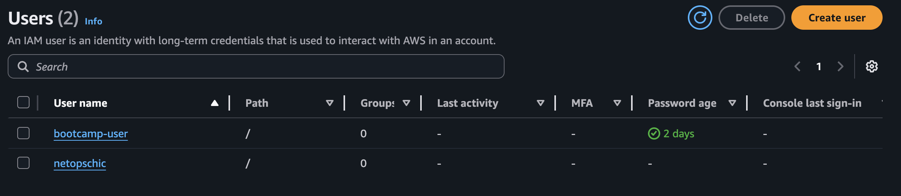
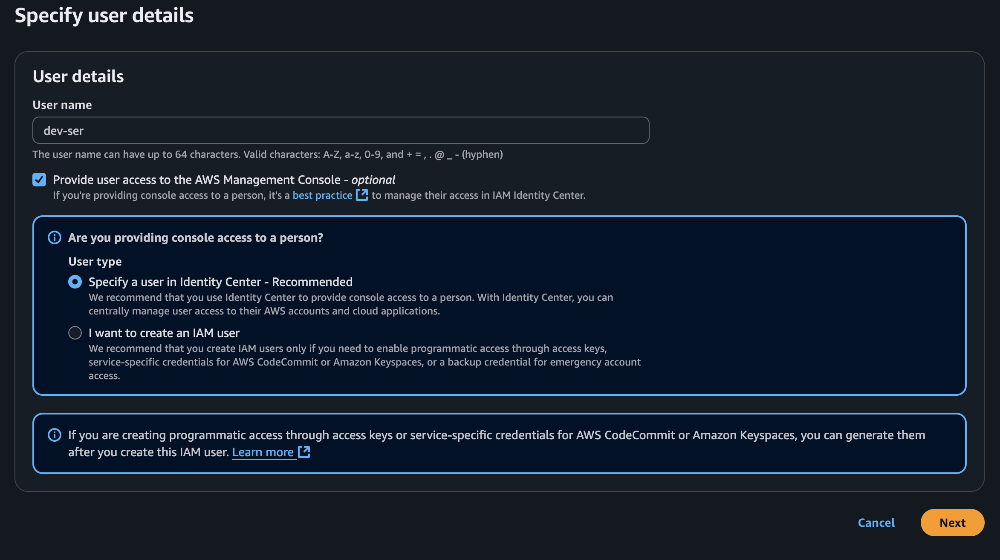
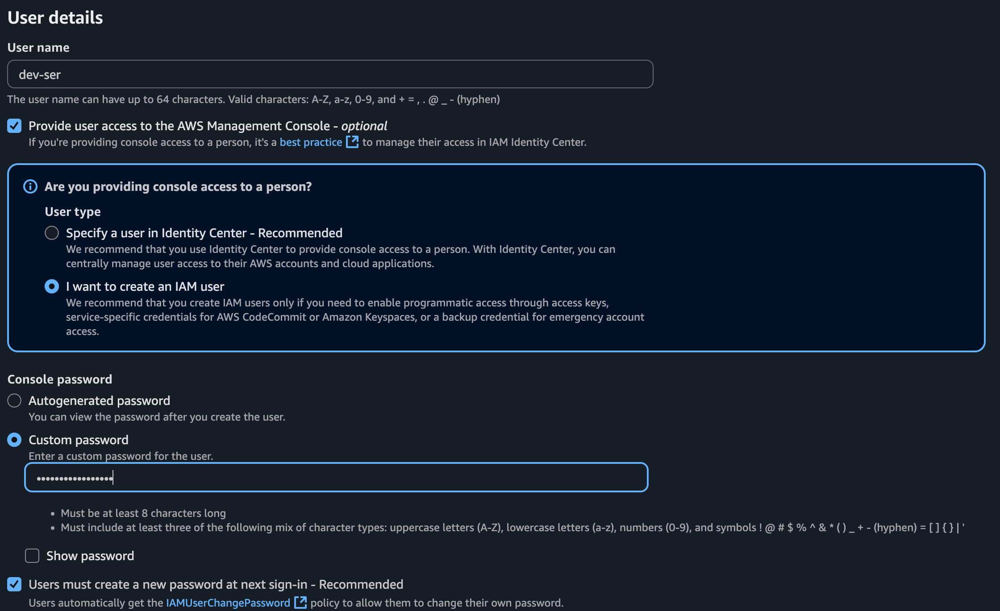
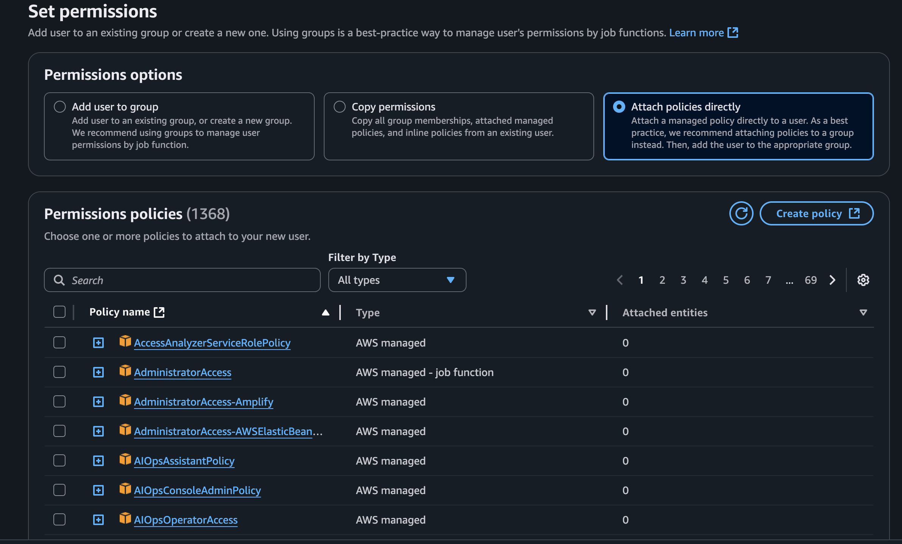
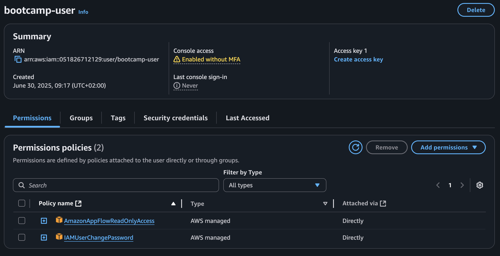

# Creating an IAM User on AWS

This guide explains how to create a new IAM user in AWS with programmatic and console access.

This is like a centralized Identity managment for entire AWS

---

## Step 1: Open IAM Console
- Sign in to the [AWS Console](https://console.aws.amazon.com/)
- In the search bar, type `IAM`
- Click on **IAM** to open the IAM dashboard



---

## Step 2: Navigate to Users
- In the left sidebar, click on **Users**
- Then click **Add users**



---

## Step 3: Add User Details
- **User name**: `bootcmp-user` (or any name you prefer)
- **Access type**: (optional)
  - Check **Programmatic access** (for CLI/SDK)
  - Check **AWS Management Console access** if UI login is needed
- Set a password (choose auto-generated or custom)



---

## Step 4: Set Permissions
- Choose **Attach existing policies directly**
- Select a policy like `AmazonS3ReadOnlyAccess` or `AdministratorAccess` for testing
- (You can also create a custom policy if needed)



---

## Step 5: Review and Create User
- Review all settings
- Click **Create user**



---

## Step 7: Save Credentials
- Save the **Access key ID** and **Secret access key**
- Download the `.csv` file or copy/paste securely

**Important:** You won’t be able to view the secret key again later.

---

## Optional: Test IAM Access
- Use the access key with AWS CLI:
```bash
aws configure
```

# Challenge

Create a user and add it to a group which can only access S3 bucket.

