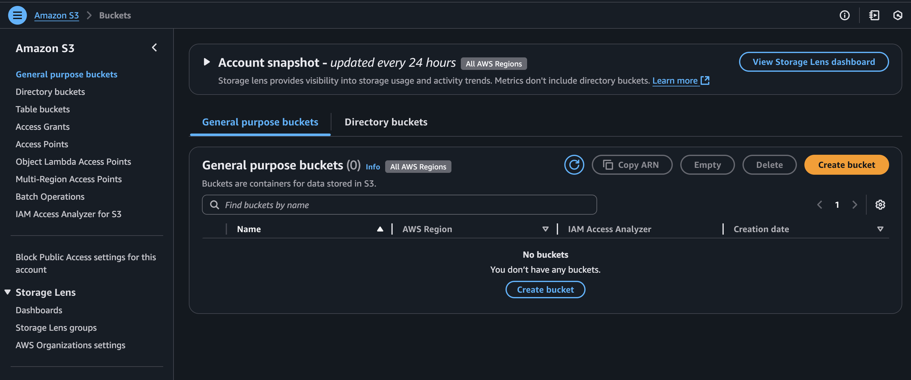
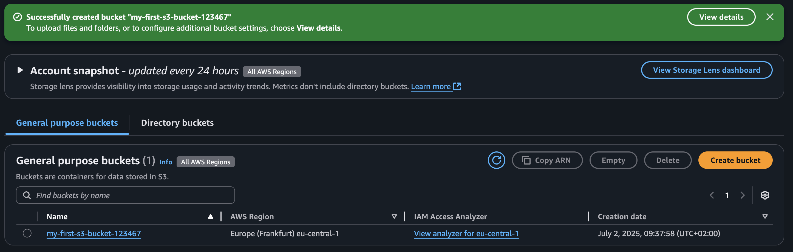
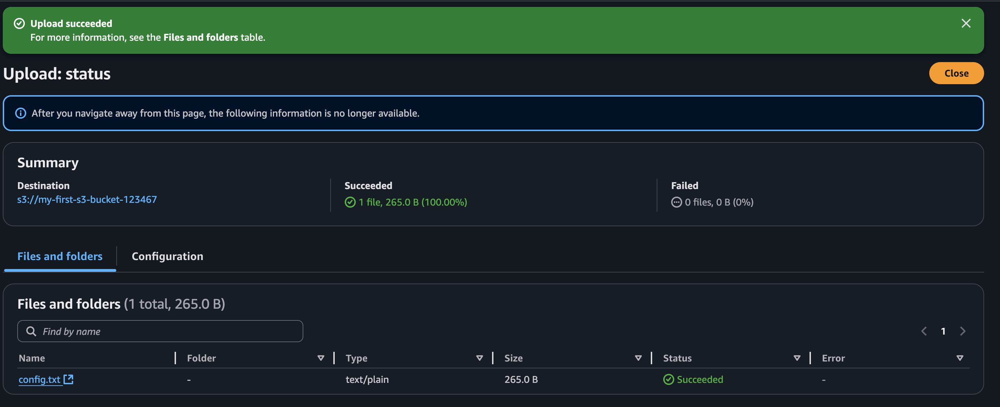

# Creating and Using an S3 Bucket on AWS

This guide walks you through how to create an S3 bucket, upload files, and configure public access for static website hosting.

Amazon Simple Storage Service (Amazon S3) is an object storage service offering industry-leading scalability, data availability, security, and performance. Millions of customers of all sizes and industries store, manage, analyze, and protect any amount of data for virtually any use case, such as data lakes, cloud-native applications, and mobile apps. With cost-effective storage classes and easy-to-use management features, you can optimize costs, organize and analyze data, and configure fine-tuned access controls to meet specific business and compliance requirements.

There are different class of s3, following is  a simplified availability and durability chart for Amazon S3 storage classes

| **S3 Storage Class**                   | **Availability**       | **Durability**                 | **Minimum Storage Duration**   | **Use Case**                                              |
| -------------------------------------- | ---------------------- | ------------------------------ | ------------------------------ | --------------------------------------------------------- |
| **S3 Standard**                        | 99.99%                 | 99.999999999% (11 9’s)         | None                           | Frequently accessed data                                  |
| **S3 Intelligent-Tiering**             | 99.9% – 99.99%         | 99.999999999%                  | 30/90 days (for archive tiers) | Unknown or changing access patterns                       |
| **S3 Standard-IA** (Infrequent Access) | 99.9%                  | 99.999999999%                  | 30 days                        | Infrequently accessed data                                |
| **S3 One Zone-IA**                     | 99.5%                  | 99.999999999% (single AZ only) | 30 days                        | Low-cost storage in a single AZ                           |
| **S3 Glacier Instant Retrieval**       | 99.9%                  | 99.999999999%                  | 90 days                        | Long-lived, rarely accessed, needs milliseconds retrieval |
| **S3 Glacier Flexible Retrieval**      | 99.99% (after restore) | 99.999999999%                  | 90 days                        | Archives, minutes-to-hours retrieval                      |
| **S3 Glacier Deep Archive**            | 99.99% (after restore) | 99.999999999%                  | 180 days                       | Cold archives, retrieval in hours                         |
| **S3 Reduced Redundancy (deprecated)** | 99.99%                 | 99.99%                         | N/A                            | **Not recommended** (replaced by other options)           |

---

## Step 1: Open S3 Console
- Sign in to the [AWS Console](https://console.aws.amazon.com/)
- In the search bar, type `S3`
- Click on **S3** to open the S3 dashboard
- For now its empty.

---

## Step 2: Create a Bucket
- Click **Create bucket**

**Settings:**
- Bucket name: must be **globally unique** (e.g., `my-first-s3-bucket-123`)
- Region: choose your preferred region
- Keep ACL disable, Policy default
- Keep other settings default for now

Click **Create bucket** at the bottom.

---

## Step 3: Upload a File
- Click on your new bucket name
- Choose **Upload**
- Drag & drop or select a file
- Click **Upload**

---

## Step 4: Make File Public (Optional)
- After upload, click the file name
- Click **Object actions > Make public**
- Confirm public access

> Note: Your bucket must allow public access for this to work. Modify bucket policy if needed. ACL needs to be enabled

# Challenge

Make an s3 bucket. Make it Public. Add some policies. If you are feeling luck make static website out of it.
