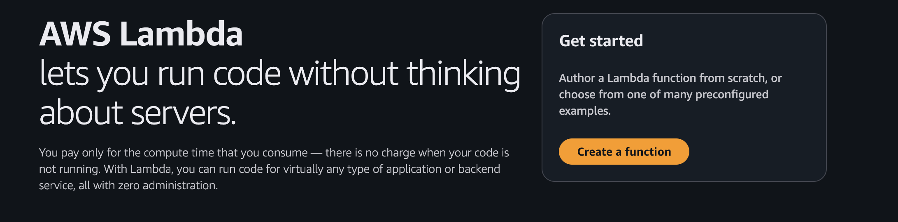
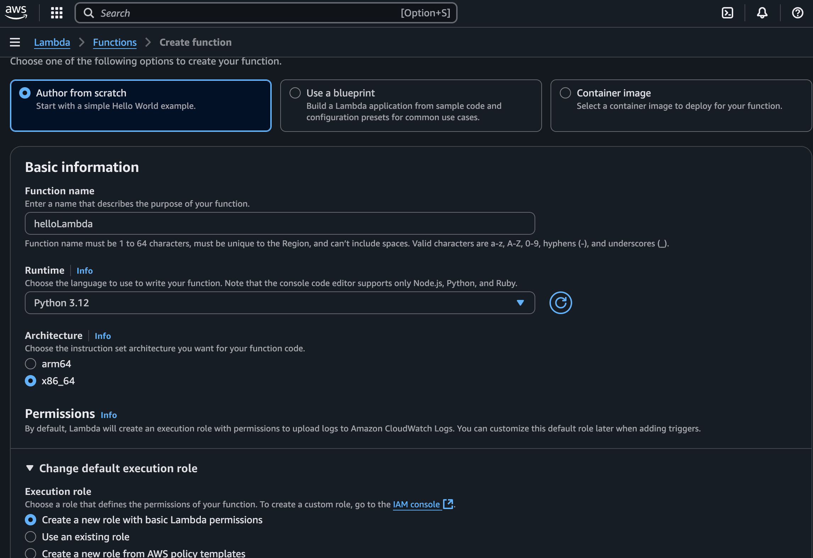
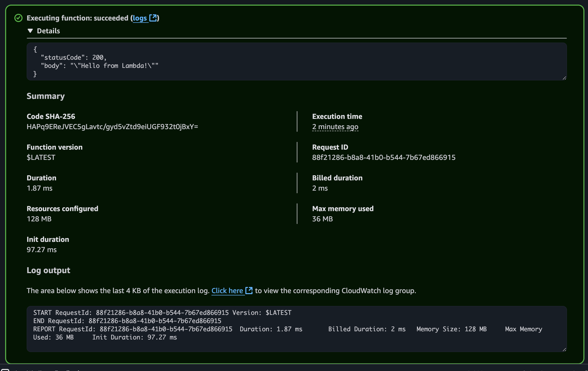

# Creating a Lambda Function on AWS

This guide explains how to create, test, and trigger a basic AWS Lambda function from the AWS Console.

Lambda runs your code automatically when a specific event happens. Like workflows!

---
## Use case

You want to log the metadata of every file uploaded to an S3 bucket (e.g., filename, size, and timestamp). A Lambda function will be triggered by an S3 ObjectCreated event.

## Step 1: Open Lambda Console
- Sign in to the [AWS Console](https://console.aws.amazon.com/)
- Search for **Lambda** and open the **Lambda Dashboard**



---

## Step 2: Create a Function
- Click **Create function**
- Choose **Author from scratch**

**Settings:**
- Function name: `helloLambda`
- Runtime: `Python 3.12` (or any you prefer)
- Execution role:
  - Choose **Create a new role with basic Lambda permissions**

Click **Create function**



---

## Step 3: Add Function Code
- In the **Code source** editor, use this simple Python example:

```python
def lambda_handler(event, context):
    return {
        'statusCode': 200,
        'body': 'Hello from Lambda!'
    }
```
Save it

## Step 4: Test it

1. Create a quick event and test it.



# Challenge

Create a real event driven lamda function such that the function is triggered when someone uplodas a file in your s3 bucket.

# Final ToDo

Post about your journey, what you learned on different platforms like LinkedIn, Twitter or any other of your favourite platforms. Follow up on your journey and share it with others! Use the Hashtags #NetAutoBootcamp #NetworkAutomation
You can also tag us on LinkedIn with @netauto-group-rheinmain