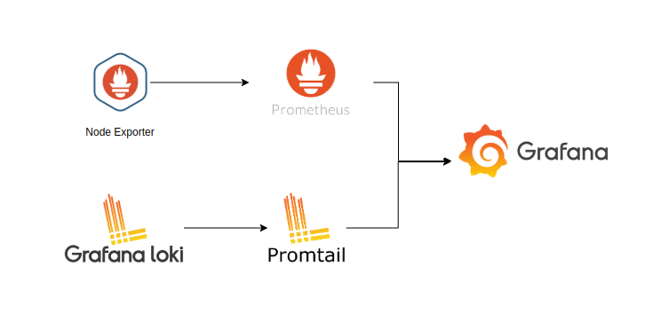

# Observability Stack

## Why Observability Matters

Observability isn’t just for DevOps and SREs anymore. As software increasingly drives business outcomes, the internal health and performance of your infrastructure become business KPIs
affecting revenue, user experience, and operational costs. Observability empowers technical teams to troubleshoot faster, but it also provides self-service access to real-time insights for product owners, customer support, and business leaders. For example, understanding a sudden latency spike in user signups can help both engineers and marketers respond immediately. Well-instrumented observability makes it possible to tie system metrics to business objectives, such as conversion rates, retention, and SLAs.

## 1. The Three Pillars of Observability

Modern observability stacks are built around three core types of telemetry data **metrics, logs, and traces** often referred to as “the three pillars.” Each plays a unique role in making complex systems transparent and diagnosable:

### 1. **Metrics**
- **What:** Numeric measurements collected and stored as time series.
- **Examples:** CPU usage, memory consumption, HTTP request rates, error rates, latency percentiles.
- **Best Practices:**  
  - Use dimensional labels (e.g., `service=checkout`, `region=us-west`) for flexible filtering and aggregation.
  - Select aggregation types carefully:
    - **Counter:** Ever-increasing value (e.g., requests served).
    - **Gauge:** Represents a value at a single point in time (e.g., temperature, memory in use).
    - **Histogram/Summary:** Distribution of observed values (e.g., request durations).
- **Business Value:** Track trends over time, set up alerts on thresholds, and correlate infrastructure health with business outcomes.

### 2. **Logs**
- **What:** Timestamped records of discrete events either human-readable text or structured data (JSON).
- **Examples:**  
  - Web server access logs  
  - Application errors and warnings  
  - Audit trails for security or compliance
- **Best Practices:**  
  - Structure logs as JSON to enable easier searching and correlation.
  - Always include contextual fields: `request_id`, `user_id`, `service_name`, etc.
  - Never log sensitive data (PII, passwords, secrets).
- **Business Value:**  
  - Accelerate investigations by filtering for correlated events.
  - Support compliance, auditing, and incident postmortems.

### 3. **Traces**
- **What:** End-to-end record of a request’s journey through a distributed system broken into **spans** representing individual operations.
- **Examples:**  
  - A user transaction traced across frontend, API, and database services.
  - Latency breakdown for a microservice request.
- **Best Practices:**  
  - Use context propagation (trace IDs, span IDs) so that traces are linked across service boundaries.
  - Annotate spans with attributes (e.g., error status, user info).
  - Use OpenTelemetry SDKs to ensure compatibility and richness.
- **Business Value:**  
  - Pinpoint performance bottlenecks and sources of errors in complex architectures.
  - Quantify the impact of dependencies on customer experience.

---

## 2. Observability vs. Monitoring

- **Monitoring** focuses on detecting known issues by tracking predefined metrics or logs. For example, “Send an alert if CPU is over 90% for 5 minutes.” Monitoring helps you catch what you expect can go wrong.
- **Observability** is about empowering teams to explore, understand, and **debug new and unknown issues** by making systems “explain themselves” through comprehensive instrumentation. Observability encourages **ad hoc querying, rich dashboards, and root cause analysis** critical for today’s dynamic, distributed system.

---

## 3. Why Observability Is Critical

- **Faster Incident Resolution:**  
  - Drill down from a high-level alert, through relevant metrics, into the exact log lines and traces associated with the problem.
  - Reduce mean time to detect (MTTD) and mean time to resolve (MTTR).
- **Proactive Performance Optimization:**  
  - Spot capacity issues or emerging bottlenecks before they degrade user experience.
  - Tune systems for business peaks (sales events, launches) with data-driven confidence.
- **Operational and Business Confidence:**  
  - Reliable, transparent systems foster trust across engineering and business teams.
  - Observability data helps prove SLA compliance, optimize costs, and align technical metrics with customer impact.

---

## 4. Example: The Observability Stack in Practice

A typical modern stack might include:

| Layer          | Example Tools                        |
|----------------|-------------------------------------|
| **Metrics**    | Prometheus, Grafana Cloud, Datadog  |
| **Logs**       | Loki, Elasticsearch, Splunk         |
| **Traces**     | Tempo, Jaeger, Zipkin, OpenTelemetry Collector |
| **Dashboards** | Grafana, Kibana, Datadog            |
| **Alerting**   | Grafana Alerting, PagerDuty, Opsgenie|

All components should interoperate clicking a metric in Grafana might take you directly to relevant logs or traces.

---

## References
- [OpenTelemetry Observability Primer](https://opentelemetry.io/docs/concepts/observability-primer/)
- [Grafana Observability Docs](https://grafana.com/docs/observability/)
- [Google SRE Book: Monitoring Distributed Systems](https://sre.google/sre-book/monitoring-distributed-systems/)

