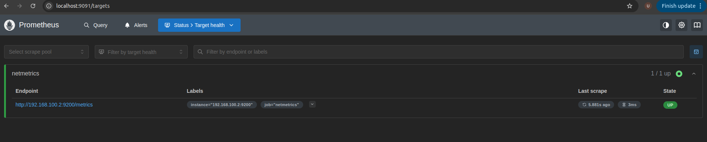

# Prometheus Fundamentals and setup Guide

Prometheus is an open-source monitoring system that **collects and stores metrics as time series**, where each data point is a numeric value paired with a timestamp and zero or more key–value **labels**.  Labels provide a _dimensional data model_, letting you slice and dice metrics by arbitrary attributes (for example, HTTP request counts broken down by status code, handler path, or method).  Internally, each unique combination of metric name and label set is a separate time series; any change in label values (including adding or removing labels) results in a new series.

### Pull vs. Push

A core architectural decision in monitoring systems is how metrics flow from applications into the monitoring back end:

- **Pull model**: the Prometheus server actively “scrapes” metrics by sending HTTP requests to instrumented targets at regular intervals.  
- **Push model**: clients push metrics out to the monitoring system (or an intermediary like the Pushgateway).  

While some monitoring platforms are push-only, Prometheus’ default **pull-based** approach offers key advantages:  
1. **Dynamic target discovery & HA** - you can run multiple Prometheus servers in parallel without reconfiguring your applications, and simply point them at the same list of targets.  
2. **Built-in health checks** - the special `up` metric indicates whether a scrape succeeded, making it trivial to know if a target is down.  
3. **On-demand debugging** - you can manually browse a `/metrics` endpoint in your browser or with `curl` to inspect raw metric output.

#### Pull

- **How it works**: Prometheus reads its `scrape_configs` from `prometheus.yml`, discovers targets (via static lists, DNS, or service-discovery APIs), and issues HTTP GET requests to each target’s `/metrics` path at the configured `scrape_interval`.  
- **Configuration example**:
  ```yaml
  scrape_configs:
    - job_name: 'my-service'
      static_configs:
        - targets: ['localhost:9100', 'db.example.com:9100']
      scrape_interval: 15s
  ```
- **High availability & portability**: you can spin up a secondary Prometheus instance (e.g. on your laptop) pointed at the same targets to test changes or provide redundancy no changes to your services are needed.

#### Push

While Prometheus is designed around scraping, **short-lived batch jobs** or environments that can’t be scraped (e.g. serverless functions) can **push** metrics to a **Pushgateway**:

- **Pushgateway role**: an intermediary that **temporarily stores** pushed metrics and exposes them over HTTP for Prometheus to scrape.  
- **When to use**: only for jobs that start, perform work, and exit too quickly to be scraped.  
- **Caveats**:  
  - The Pushgateway becomes a **single point of failure** and can accumulate orphaned series unless you explicitly delete them.  
  - You lose the native `up` metric, so Prometheus cannot automatically detect if a push gateway endpoint is unreachable.  
  - It’s **not** intended for general application metrics prefer the pull model wherever possible.

Alternatively, for forwarding metrics between Prometheus servers or to long-term storage, Prometheus supports a **remote_write** API that lets an agent or server **push** data to remote backends (e.g., Thanos, Cortex, or other Prometheus instances) without using the Pushgateway.

---

### Key Takeaways

- Prometheus’ **dimensional time series model** (metric + labels) powers expressive querying and aggregation via PromQL.  
- The **pull-based** scrape model simplifies HA, discovery, and debugging; rely on **push** (Pushgateway or remote_write) only when you cannot scrape directly.  
- Always be mindful of label cardinality each unique label set creates a separate time series, which impacts storage and performance.

---

## Step-by-Step Installation

### 1. Download Prometheus

Visit the [Prometheus download page](https://prometheus.io/download/) and grab the latest release for your operating system.

**Example for Linux:**
```bash
wget https://github.com/prometheus/prometheus/releases/latest/download/prometheus-*.linux-amd64.tar.gz
tar xvf prometheus-*.linux-amd64.tar.gz
cd prometheus-*.linux-amd64
```

### 2. Explore the Directory

You should see:
- `prometheus` (the main server binary)
- `promtool` (for checking config)
- `prometheus.yml` (default config)
- `consoles/` and `console_libraries/` (UI files)

---

### 3. (Optional) Edit Configuration

The main config is `prometheus.yml`. By default, Prometheus scrapes itself:

```yaml
scrape_configs:
  - job_name: "prometheus"
    static_configs:
      - targets: ["localhost:9090"]
```

To add other exporters (e.g., Node Exporter):

```yaml
scrape_configs:
  - job_name: "node"
    static_configs:
      - targets: ["localhost:9100"]
```

---

### 4. Start Prometheus

```bash
./prometheus --config.file=prometheus.yml
```

By default, Prometheus starts a web UI at [http://localhost:9090](http://localhost:9090).

---

### 5. Verify the Setup

- Visit [http://localhost:9090](http://localhost:9090)
- Check “Status” > “Targets” to confirm your endpoints are being scraped.


---

## 6. Running Prometheus as a Service

Create a systemd service at `/etc/systemd/system/prometheus.service`:

```ini
[Unit]
Description=Prometheus
Wants=network-online.target
After=network-online.target

[Service]
User=nobody
ExecStart=/path/to/prometheus   --config.file=/path/to/prometheus.yml   --storage.tsdb.path=/path/to/data

[Install]
WantedBy=default.target
```
Reload and start the service:
```bash
sudo systemctl daemon-reload
sudo systemctl start prometheus
sudo systemctl enable prometheus
```

---

## 7. Basic Queries

Try sample queries in the web UI:
- `up` - see which targets are online
- `prometheus_build_info` - check Prometheus version
- `rate(http_requests_total[5m])` - requests per second, 5 min window

---

## References

- [Prometheus: Getting Started](https://prometheus.io/docs/introduction/first_steps/)
- [Prometheus Configuration](https://prometheus.io/docs/prometheus/latest/configuration/configuration/)

