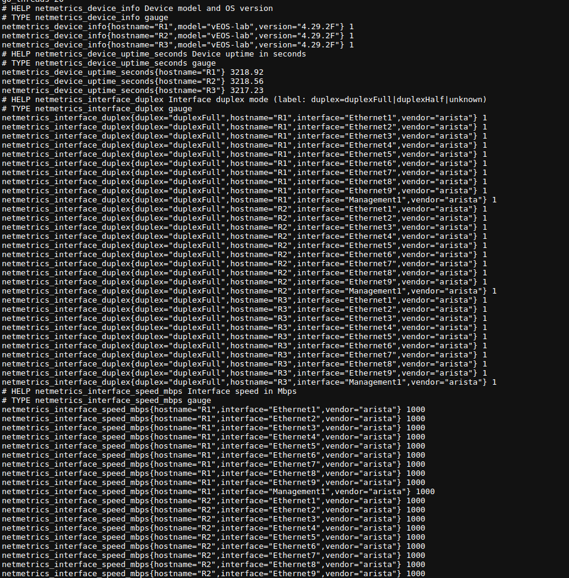

# Prometheus Node Exporter: Setup Guide

[Official documentation](https://prometheus.io/docs/guides/node-exporter/)

---

## What is Node Exporter?

Node Exporter is a Prometheus exporter for hardware and OS metrics exposed by *nix kernels. It allows you to monitor CPU, memory, disk, network, filesystem, and more—essential for infrastructure monitoring.

---

## Step-by-Step Installation

### 1. Download the Node Exporter

Visit the [releases page](https://prometheus.io/download/#node_exporter) and download the latest version for your platform.

**Example for Linux:**
```bash
wget https://github.com/prometheus/node_exporter/releases/latest/download/node_exporter-*.linux-amd64.tar.gz
tar xvf node_exporter-*.linux-amd64.tar.gz
cd node_exporter-*.linux-amd64
```

### 2. Run the Node Exporter

Start the binary:
```bash
./node_exporter
```
By default, it exposes metrics at:  
[http://localhost:9100/metrics](http://localhost:9100/metrics)

### 3. Test the Exporter

Visit [http://localhost:9100/metrics](http://localhost:9100/metrics) in your browser or:
```bash
curl http://localhost:9100/metrics
```
You should see plain text metrics output.



---

## 4. Add Node Exporter to Prometheus

Edit your `prometheus.yml` scrape configs to add a new job (previous tutorial):
```yaml
scrape_configs:
  - job_name: 'node'
    static_configs:
      - targets: ['localhost:9100']
```
> If monitoring remote nodes, replace `localhost` with the node's address.

---

## 5. Run Node Exporter as a Service (Recommended)

Create a systemd unit file at `/etc/systemd/system/node_exporter.service`:
```ini
[Unit]
Description=Node Exporter
After=network.target

[Service]
User=nobody
ExecStart=/path/to/node_exporter

[Install]
WantedBy=default.target
```
Reload systemd and start the service:
```bash
sudo systemctl daemon-reload
sudo systemctl start node_exporter
sudo systemctl enable node_exporter
```
---

## References

- [Prometheus Node Exporter Guide](https://prometheus.io/docs/guides/node-exporter/)
- [Node Exporter GitHub](https://github.com/prometheus/node_exporter)