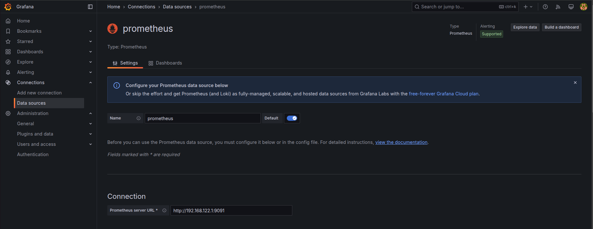
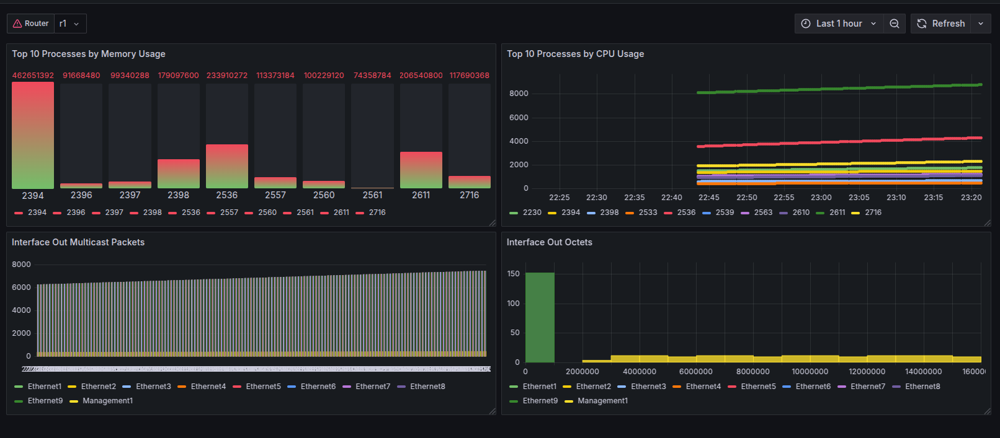

# Grafana: Overview and Setup Guide

[Official documentation](https://grafana.com/docs/grafana/latest/)

---

## What is Grafana?

Grafana is an open-source platform for **visualizing, querying, and analyzing** metrics, logs, and other data collected from a variety of sources. It lets you build interactive, real-time dashboards using a web interface. Grafana supports a wide range of data sources including Prometheus, Graphite, InfluxDB, Loki, Elasticsearch, MySQL, PostgreSQL, and many others.  
- **Dashboards:** Grafana's core feature is the ability to create dashboards. Each dashboard can have multiple panels graphs, tables, heatmaps, and more each visualizing data from one or more sources.
- **Alerting:** You can set up alerts to notify you when metrics cross thresholds, integrating with Slack, email, PagerDuty, and others.
- **Users & Permissions:** Grafana provides user authentication, organizations, and fine-grained dashboard sharing/permissions.
- **Plugins:** Extend Grafana’s capabilities with plugins for new visualizations, data sources, and app integrations.

> **Reference:** [What is Grafana?](https://grafana.com/docs/grafana/latest/introduction/)

---

## How does Grafana work?

- **Data Source Connection:** Grafana does not store your data. Instead, it connects to your existing databases and services. You configure a data source (e.g., Prometheus, InfluxDB), and Grafana queries it in real time using queries (such as PromQL for Prometheus).
- **Panels and Queries:** Each panel in a dashboard sends one or more queries to its data source and visualizes the result using the selected panel type (graph, gauge, table, etc).
- **Dashboard Building:** You can build dashboards interactively in the web UI, add new panels, arrange them freely, and use variables for flexible queries.
- **Alerting:** Alerts can be defined on panel queries. When triggered, Grafana sends notifications to configured channels.
- **User Access:** Users log in via the web UI. Permissions can be managed for folders, dashboards, and data sources.

---

## Setting up Grafana 

### 1. Download and Install Grafana

Visit the [official download page](https://grafana.com/grafana/download) and choose the right package for your operating system.

**For Linux (64-bit .deb package):**
```bash
wget https://dl.grafana.com/oss/release/grafana-latest_amd64.deb
sudo dpkg -i grafana-latest_amd64.deb
```

**For RPM-based Linux:**
```bash
wget https://dl.grafana.com/oss/release/grafana-latest-1.x86_64.rpm
sudo rpm -Uvh grafana-latest-1.x86_64.rpm
```

**For Windows and macOS:**  
Download the installer from [here](https://grafana.com/grafana/download).

---

### 2. Start Grafana

**On Linux:**
```bash
sudo systemctl start grafana-server
sudo systemctl enable grafana-server
```

**On Windows/macOS:**  
Run the `grafana-server` executable (see the [platform instructions](https://grafana.com/docs/grafana/latest/setup-grafana/installation/)).

---

### 3. Access the Web UI

- Open your browser and go to: [http://localhost:3000](http://localhost:3000)
- Default login:  
  - **User:** `admin`  
  - **Password:** `admin`  
  - You’ll be prompted to set a new password after first login.

---

### 4. Add a Data Source

1. In the Grafana UI, click **"Connections"** > **"Add data source"**
2. Choose your backend (e.g., Prometheus)
3. Enter the URL for your data source (e.g., `http://localhost:9090` for Prometheus)
4. Click **"Save & Test"** to confirm connectivity



---

### 5. Create Your First Dashboard

1. Click the “+” icon > **"Dashboard"**
2. Add a new panel
3. Choose your data source and write a query (e.g., `up` for Prometheus)
4. Choose the visualization type (graph, gauge, etc)
5. Save your dashboard

Note: It always good to import pre built dashboard like below



---

## References

- [Grafana Official Documentation](https://grafana.com/docs/grafana/latest/)
- [Install Grafana](https://grafana.com/docs/grafana/latest/setup-grafana/installation/)
- [Getting Started](https://grafana.com/docs/grafana/latest/getting-started/getting-started/)

## Challenges

Try the entire setup yourself! Follow this tutorial to setup the entire stack using docker: 
[Logging and Monitoring Stack with Docker Compose: Promtail, Node Exporter, Prometheus, Loki, and Grafana](https://medium.com/@netopschic/logging-and-monitoring-stack-with-docker-compose-promtail-node-exporter-prometheus-loki-and-cd54657301ec)
