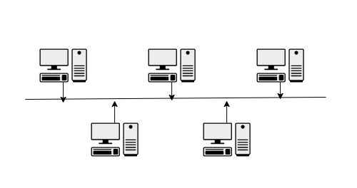
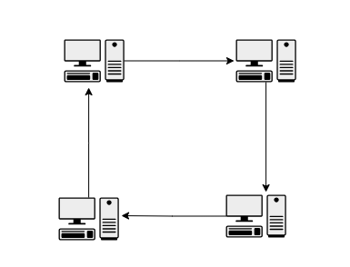
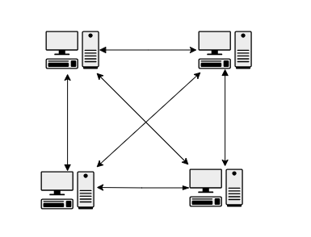
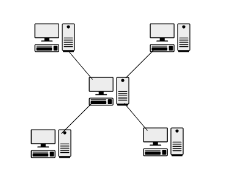
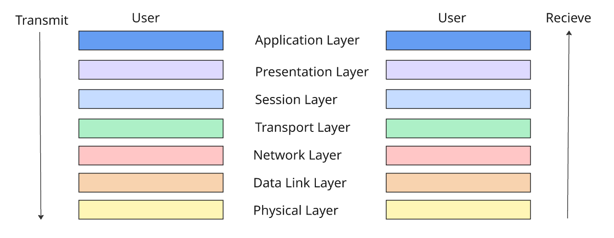

# Introduction of Computer Networks
## Whats is a network ?

A computer network is a collection of interconnected devices that share resources and information. These devices can include computers, servers, printers, and other hardware. Networks allow for the efficient exchange of data, enabling various applications such as email, file sharing, and internet browsing.

It can also be defined as A network is a collection of network-enabled devices, typically made up of computers, switches, routers, printers, and servers. Networks are a fundamental part of day-to-day life, and exist in homes, workplaces, and public areas. Networks allow all types of network-enabled devices to communicate.

A computer network is a system that connects multiple computers, devices, and digital resources, allowing them to communicate, share data, and access resources like files, printers, and internet connections. It enables devices to work together efficiently, creating a collaborative digital environment regardless of location.

Basically a group of device connected via a medium which shares data thats a network

## What are the type of networks?

Networks vary in size, shape, and usage. To make it easier to identify different network types, they fall into one of the following network categories:

### Personal area networks:

A personal area network (PAN) provides networking needs around an individual. An example of a PAN is where a smartphone, smartwatch, tablet, and laptop all connect and share data without the need to connect to an access point or other non-Microsoft network services. PAN networks typically use Bluetooth® to communicate because it provides a low-power, short-range data-sharing capability. The network standards associated with a PAN are Bluetooth and IEEE 802.15.

### Local area networks

A local area network (LAN) provides networking needs around a single location, such as an office, a school, a university, a hospital, or an airport. Typically, a LAN is privately owned and requires authentication and authorization to access. Of the different classifications of a network, a LAN is by far the most commonly used.

### Metropolitan area networks

A metropolitan area network (MAN) provides networking capabilities between different locations within a city or metropolitan area to provide a single extensive network. Typically, a MAN requires a dedicated and secure connection between each LAN joined to the MAN.

### Wide area networks

A wide area network (WAN) provides networking capabilities between different geographical locations locally or worldwide. For example, a WAN is used to connect an organization's head office with branch offices all over the region. A WAN links multiple LANs together to create one super network. With a WAN, you use a virtual private network (VPN) to manage the connection between different LANs.

## Network topology

### Bus 

In a bus topology, each network device is connected to a single network cable. Even though it's the simplest type of network to implement, it has limitations. The first limitation is the length of the main cable or bus. The longer it gets, the higher the chance of signal dropout. This limitation constrains the physical layout of the network. All devices must be physically located near each other, for example, in the same room. Finally, if there's a break in the bus cable, the whole network fails.

  

### Ring

In a ring topology, each network device is connected to its neighbor to form a ring. This form of network is more resilient than the bus topology. A break in the cable ring also affects the performance of the network.

  

### Mesh

The mesh topology is described as either a physical mesh or a logical mesh.
In a physical mesh, each network device connects to every other network device in the network. It dramatically increases the resilience of a network, but has the physical overhead of connecting all devices. Few networks today are built as a full mesh. Most networks use a partial mesh, where some machines interconnect, but others connect through one device.

  

There's a subtle difference between a physical mesh network and a logical one. The perception is that most modern networks are mesh based, since each device can see and communicate with any other device on the network. However, this topology describes a logical mesh network, and is primarily made possible by using network protocols.

### Star

The star topology is the most commonly used network topology. Each network device connects to a centralized hub or switch. Switches and hubs can be linked together to extend and build more extensive networks. This type of typology is, by far, the most robust and scalable.

  

## OSI Layer

The Open Systems Interconnection (OSI) model describes seven layers that computer systems use to communicate over a network. The OSI model is divided into seven distinct layers, each with specific responsibilities, ranging from physical hardware connections to high-level application interactions.

  

Each layer of the OSI model interacts with the layer directly above and below it, encapsulating and transmitting data in a structured manner. This approach helps network professionals troubleshoot issues, as problems can be isolated to a specific layer. The OSI model serves as a universal language for networking, providing a common ground for different systems to communicate effectively.

# OSI Model Explained Simply

The OSI (Open Systems Interconnection) model has 7 layers. Each layer has a role in how data moves across a network. Here’s a beginner-friendly breakdown with everyday analogies.

## 1. Physical Layer – The Road  
Think of this as the actual road that cars drive on.  
- In networking, this is the cables, connectors, and signals (electrical or light).  
- It’s about how bits physically move from one place to another.  
**Example:** Ethernet cables, fiber optics, Wi-Fi signals.

## 2. Data Link Layer – The Traffic Rules  
This is like the road rules and traffic lights that ensure cars don’t crash.  
- Decides who can use the road and detects collisions.  
- Gives each car a license plate — in networking, that’s the MAC address.  
**Example:** Ethernet frames, switches, MAC addresses, error detection.

## 3. Network Layer – The GPS  
Your GPS decides which roads to take to reach your destination.  
- In networking, it’s routing — figuring out the best path to the destination.  
- Uses IP addresses like street addresses.  
**Example:** IP protocol, routers, routing tables.

## 4. Transport Layer – The Delivery Service  
The delivery service ensures packages arrive safely and in the right order.  
- Provides reliability, error correction, and sequencing.  
- Some services guarantee delivery (TCP), others just send without guarantees (UDP).  
**Example:** TCP, UDP, port numbers.

## 5. Session Layer – The Conversation Host  
The meeting host starts the conversation, keeps it on track, and ends it politely.  
- Starts, manages, and ends communication between devices.  
- Handles session recovery if something breaks mid-way.  
**Example:** NetBIOS, RPC, session tokens.

## 6. Presentation Layer – The Translator  
When two people speak different languages, you need a translator.  
- Formats data so both sides understand it.  
- May also encrypt or compress data.  
**Example:** JPEG, MP3, SSL/TLS encryption.

## 7. Application Layer – The Restaurant Menu  
This is what you actually interact with — the menu you order from.  
- Apps request network services here.  
- The part you see when you browse the web or send an email.  
**Example:** HTTP, SMTP, FTP, DNS.

---

**Easy Memory Trick:**  
Please Do Not Throw Sausage Pizza Away  
(Physical → Data Link → Network → Transport → Session → Presentation → Application)

## References – Introduction to Computer Networks

- **Definition of computer networking and connected devices**  
  Cisco – [What is computer networking?](https://www.cisco.com/site/us/en/learn/topics/networking/what-is-computer-networking.html)

- **Types of area networks (PAN, LAN, MAN, WAN)**  
  Simplilearn – [Types of Networks: LAN, WAN, MAN & More Explained](https://www.simplilearn.com/tutorials/networking-tutorial/importance-of-types-of-networks-lan-man-wan)  
  GeeksforGeeks – [Types of Computer Networks](https://www.geeksforgeeks.org/computer-networks/types-of-computer-networks/)

- **LAN vs WAN overview**  
  Cisco – [What is Network Architecture?](https://www.cisco.com/site/us/en/learn/topics/networking/what-is-network-architecture.html)  
  AWS – [The Difference Between LAN & WAN](https://aws.amazon.com/compare/the-difference-between-lan-and-wan/)

- **WAN detailed explanation**  
  Cloudflare – [What is a WAN?](https://www.cloudflare.com/learning/network-layer/what-is-a-wan/)

- **Network topologies (bus, ring, mesh, star)**  
  Wikipedia – [Local Area Network](https://en.wikipedia.org/wiki/Local_area_network)  
  Cisco – [What is Network Design?](https://www.cisco.com/site/us/en/learn/topics/networking/what-is-network-design.html)

- **OSI model description**  
  Imperva – [What Is the OSI Model](https://www.imperva.com/learn/application-security/osi-model/)  
  Wikipedia – [OSI model](https://en.wikipedia.org/wiki/OSI_model)  
  Cloudflare – [What is the OSI Model?](https://www.cloudflare.com/learning/ddos/glossary/open-systems-interconnection-model-osi/)

