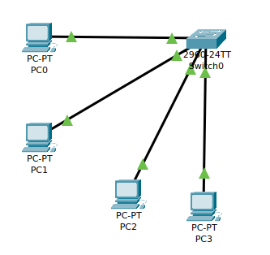
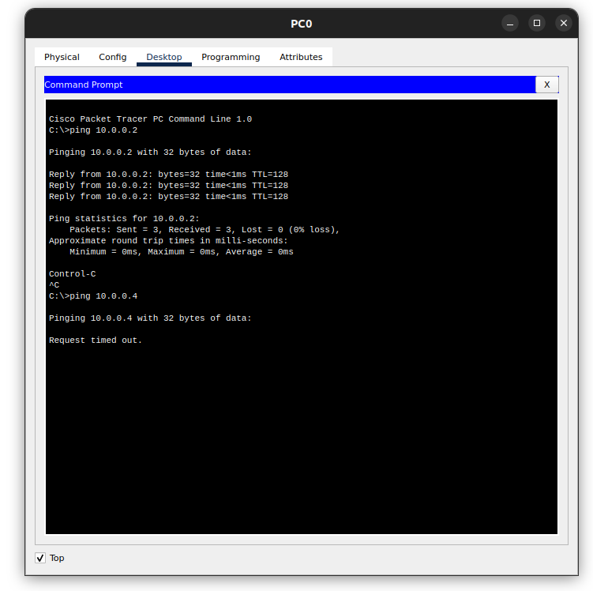
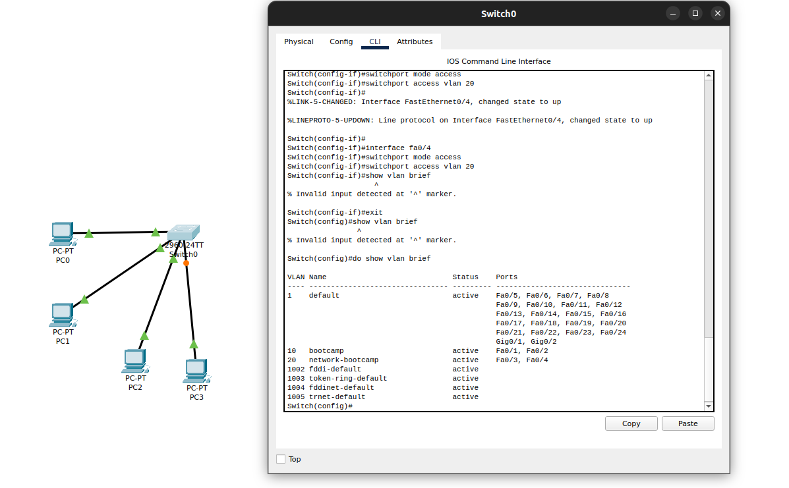

# VLAN

Gain a solid understanding of VLANs — what they are, why they exist, and how to configure them using Cisco Packet Tracer.

---

## 1) Introduction

A **VLAN (Virtual Local Area Network)** is a way to logically segment a physical network into multiple broadcast domains. Think of it as **dividing one big room into smaller rooms using partitions** — people in one room can’t hear the noise from another unless you connect them with a door (router).

---

## 2) Why VLANs Matter

* **Efficiency:** Reduces unnecessary broadcast traffic.
* **Security:** Isolates sensitive departments.
* **Organization:** Matches network design to company structure.
* **Flexibility:** VLAN assignments are logical, not tied to physical layout.

---

## 3) Core Concepts

* **VLAN ID:** Identifies the VLAN (1–4094).
* **Access Port:** Belongs to a single VLAN, untagged frames.
* **Trunk Port:** Carries multiple VLANs with 802.1Q tagging.
* **Native VLAN:** Untagged VLAN on a trunk link.

**Analogy:** Imagine a hotel (switch) with multiple floors (VLANs). Each floor is isolated you need the elevator (router) to go between floors.

---

## 4) Hands on: Cisco Packet Tracer VLAN Setup

**Step-by-Step:**

<p align="center">
  
</p>

1. **Open** Cisco Packet Tracer.
2. **Add** one switch (2960) and 4 PCs.
3. **Connect** PCs to switch with copper straight-through cables.
4. **Assign VLANs:**

```
Switch> enable
Switch# configure terminal
Switch(config)# vlan 10
Switch(config-vlan)# name Sales
Switch(config-vlan)# vlan 20
Switch(config-vlan)# name Engineering
```

5. **Assign Ports to VLANs:**

```
Switch(config)# interface fa0/1
Switch(config-if)# switchport mode access
Switch(config-if)# switchport access vlan 10
Switch(config)# interface fa0/2
Switch(config-if)# switchport mode access
Switch(config-if)# switchport access vlan 10
Switch(config)# interface fa0/3
Switch(config-if)# switchport mode access
Switch(config-if)# switchport access vlan 20
Switch(config)# interface fa0/4
Switch(config-if)# switchport mode access
Switch(config-if)# switchport access vlan 20
```

6. **Assign IPs to PCs** in same VLAN subnets.

 

7. **Test:** PCs in same VLAN should ping each other; different VLANs will not communicate without a router.



---

## 5) Troubleshooting in Packet Tracer

* Check VLAN assignment: `show vlan brief`
* Verify port mode: `show interfaces switchport`
* Ensure correct IP/subnet on PCs.

 

---

## 6) Key Takeaways

* VLANs segment Layer 2 networks logically.
* Access ports connect end devices; trunk ports connect switches/routers.
* Inter-VLAN routing is needed for communication between VLANs.
* Packet Tracer is ideal for practicing VLAN setups without real hardware.

---

## References

1. [Cisco – VLAN Fundamentals](https://www.cisco.com/c/en/us/tech/lan-switching/vlan/index.html)
2. [IEEE – 802.1Q Standard Overview](https://standards.ieee.org/standard/802_1Q-2018.html)
3. [Cisco Packet Tracer – VLAN Configuration Guide](https://www.netacad.com/courses/packet-tracer)
4. [Cisco – VLAN Troubleshooting](https://www.cisco.com/c/en/us/support/docs/lan-switching/vlan/10023-3.html)
