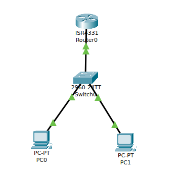
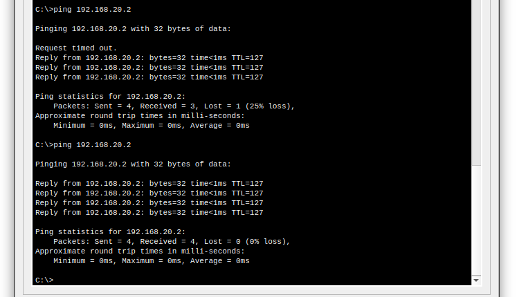

# Inter-VLAN Routing 

Understand what Inter-VLAN routing is, why it is required, and how to configure it in Cisco Packet Tracer.

---

## 1) Introduction

**Inter-VLAN routing** allows communication between devices in different VLANs by using a Layer 3 device (router or multilayer switch). Since VLANs segment networks at Layer 2, a Layer 3 process is needed to pass traffic between them.

---

## 2) Why Inter-VLAN Routing is Needed

* **VLAN isolation:** Devices in different VLANs cannot communicate by default.
* **Layer 3 forwarding:** Routers or Layer 3 switches can route traffic between VLAN subnets.
* **Centralized control:** Allows security policies and traffic filtering between VLANs.

---

## 3) Core Concepts

* **SVI (Switch Virtual Interface):** Logical interface on a Layer 3 switch to route for a VLAN.
* **Router-on-a-Stick:** Router with subinterfaces, each assigned to a VLAN, connected via a trunk link to the switch.
* **802.1Q Encapsulation:** Used on trunk ports to carry multiple VLANs.

---

## 4) Hands on: Router-on-a-Stick in Cisco Packet Tracer

**Step-by-Step:**

1. **Topology:** One router, one switch (2960), and two PCs.
2. **Assign VLANs on the switch:**

<p align="center">
  
</p>


```
Switch> enable
Switch# configure terminal
Switch(config)# vlan 10
Switch(config-vlan)# name Sales
Switch(config-vlan)# vlan 20
Switch(config-vlan)# name Engineering
```

3. **Assign ports to VLANs:**

```
Switch(config)# interface fa0/1
Switch(config-if)# switchport mode access
Switch(config-if)# switchport access vlan 10
Switch(config)# interface fa0/2
Switch(config-if)# switchport mode access
Switch(config-if)# switchport access vlan 20
```

4. **Configure trunk link to router:**

```
Switch(config)# interface fa0/24
Switch(config-if)# switchport mode trunk
Switch(config-if)# switchport trunk allowed vlan 10,20
```

5. **Configure router subinterfaces:**

```
Router> enable
Router# configure terminal
Router(config)# interface fa0/0.10
Router(config-subif)# encapsulation dot1Q 10
Router(config-subif)# ip address 192.168.10.1 255.255.255.0
Router(config)# interface fa0/0.20
Router(config-subif)# encapsulation dot1Q 20
Router(config-subif)# ip address 192.168.20.1 255.255.255.0
Router(config)# interface fa0/0
Router(config-if)# no shutdown
```

6. **Assign IPs to PCs:**

   * PC in VLAN 10: `192.168.10.2 /24`, gateway `192.168.10.1`
   * PC in VLAN 20: `192.168.20.2 /24`, gateway `192.168.20.1`
7. **Test:** Ping between PCs in different VLANs should succeed.

<p align="center">
  
</p>

---

## 5) Troubleshooting

* Check VLANs: `show vlan brief`
* Check trunk: `show interfaces trunk`
* Check router subinterfaces: `show ip interface brief`
* Ensure correct IP addressing on PCs.

---

## 6) Key Takeaways

* VLANs require Layer 3 devices to communicate.
* Router-on-a-Stick is a simple, cost-effective solution for small networks.
* Layer 3 switches provide faster, hardware-based Inter-VLAN routing.

---

## References

1. [Cisco – Configuring Router-on-a-Stick](https://www.cisco.com/c/en/us/support/docs/ip/routing-information-protocol-rip/13788-3.html)
2. [Cisco – VLAN Troubleshooting](https://www.cisco.com/c/en/us/support/docs/lan-switching/vlan/10023-3.html)
3. [Cisco IOS Command Reference – Interface Commands](https://www.cisco.com/c/en/us/td/docs/ios-xml/ios/interface/command/ir-cr-book.html)
4. [Arista – VLAN and Trunk Configuration Guide](https://www.arista.com/en/um-eos/eos-section-16-1-vlan-configuration)
5. [Arista – Inter-VLAN Routing with SVIs](https://www.arista.com/en/um-eos/eos-section-16-2-inter-vlan-routing)
