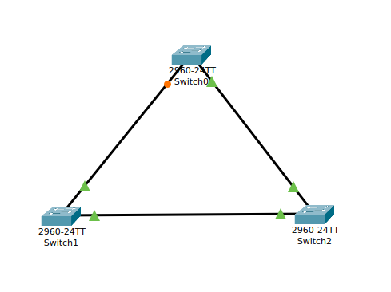

# Spanning Tree Protocol (STP) – Theory and Practical Guide

**Goal:** Understand what Spanning Tree Protocol is, why it is required, and how to configure and verify it in Cisco Packet Tracer.

---

## 1) Introduction

**Spanning Tree Protocol (STP)** is a Layer 2 network protocol that ensures a loop-free topology in bridged Ethernet networks. It automatically disables redundant paths while keeping them available for backup in case the primary link fails.

**Analogy for Beginners:** Imagine a city with multiple roads between the same two neighborhoods. If all roads are open, traffic can get stuck in circles with no exit (network loop). STP works like a smart traffic controller that closes some roads to prevent endless loops but can reopen them instantly if the main route is blocked.

---

## 2) Why STP is Needed

* **Prevent loops:** Without STP, redundant links cause broadcast storms.
* **Redundancy:** Allows backup links without causing network instability.
* **Automatic recovery:** Re-enables blocked paths when needed.

---

## 3) Core Concepts

* **Bridge Protocol Data Unit (BPDU):** STP messages exchanged to build the spanning tree.
* **Root Bridge:** The central switch in STP topology, chosen based on bridge ID.
* **Port Roles:** Root Port, Designated Port, Blocked Port.
* **STP Variants:** IEEE 802.1D (original STP), Rapid STP (802.1w), Multiple STP (802.1s).

---

## 4) Practical – STP in Cisco Packet Tracer

**Step-by-Step:**

1. **Topology:** Three switches connected in a triangle.
2. **Enable STP (default on most Cisco switches):**

look at the amber colour port that means STP is preventi

<p align="center">
  
</p>

```
Switch> enable
Switch# configure terminal
! STP is usually enabled by default, but you can specify mode:
Switch(config)# spanning-tree mode rapid-pvst
```

3. **Set a root bridge:**

```
Switch(config)# spanning-tree vlan 1 priority 24576
```

4. **Verify STP status:**

```
Switch# show spanning-tree
```

5. **Test failover:**

   * Disconnect a link and watch STP unblock a previously blocked port.

---

## 5) Troubleshooting

* **Check root bridge:** `show spanning-tree root`
* **Check port roles:** `show spanning-tree interface`
* **Verify timers and configuration:** `show spanning-tree detail`

---

## 6) Key Takeaways

* STP is critical in networks with redundant paths.
* Root bridge placement affects traffic flow.
* Rapid PVST+ provides faster convergence than traditional STP.

---

## References

1. [Arista – Understanding Spanning Tree Protocol](https://www.arista.com/en/um-eos/eos-section-19-1-spanning-tree-protocol)
2. [IEEE 802.1D Standard](https://standards.ieee.org/standard/802_1D-2004.html)
