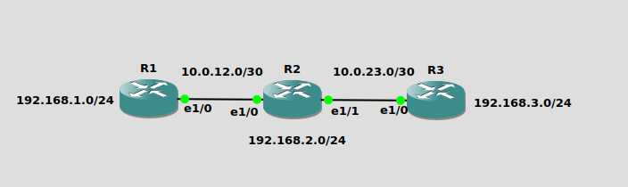

# Static Routing 

Understand static routing concepts and implement them on a simulated network with three Cisco routers.

---

## 1) Static Routing

Static routing is the process of manually configuring routes in a router’s routing table. These routes remain until they are manually deleted or the router restarts.

Routers use static routes to determine the next hop for a given destination network without running a dynamic routing protocol.

**Key Points:**

* **Layer:** Operates at Layer 3 (Network Layer) of the OSI model.
* **Control:** Administrator manually adds routes.
* **Syntax (Cisco IOS):**

  ```
  ip route [destination-network] [mask] [next-hop-ip | exit-interface]
  ```

**Advantages:**

* Predictable routing path.
* No CPU/RAM overhead for routing updates.

**Disadvantages:**

* No automatic rerouting in case of link failure.
* Administrative burden in large networks.

---

## 2) Lab Topology – 3 Cisco Routers

Note: Switching to new emulator which is gns3

**Devices:**

* R1, R2, R3 (Cisco 7200 or 2811 in GNS3 or Packet Tracer)
* Each connected in a triangle topology.

**IP Scheme:**

* R1–R2: 10.0.12.0/30
* R2–R3: 10.0.23.0/30
* R1–R3: 10.0.13.0/30
* Loopback networks:

  * R1: 192.168.1.0/24
  * R2: 192.168.2.0/24
  * R3: 192.168.3.0/24

<p align="center">
  
</p>

---

## 3) Step-by-Step Configuration (Cisco IOS) 

**On R1:**

```
configure terminal
hostname R1
interface Ethernet1/0
 ip address 10.0.12.1 255.255.255.252
 no shutdown
interface Loopback0
 ip address 192.168.1.1 255.255.255.0
ip route 192.168.2.0 255.255.255.0 10.0.12.2
ip route 192.168.3.0 255.255.255.0 10.0.12.2
end
write memory
```

**On R2:**

```
configure terminal
hostname R2
interface Ethernet1/0
 ip address 10.0.12.2 255.255.255.252
 no shutdown
interface Ethernet1/1
 ip address 10.0.23.1 255.255.255.252
 no shutdown
interface Loopback0
 ip address 192.168.2.1 255.255.255.0
ip route 192.168.1.0 255.255.255.0 10.0.12.1
ip route 192.168.3.0 255.255.255.0 10.0.23.2
end
write memory
```

**On R3:**

```
configure terminal
hostname R3
interface GigabitEthernet0/0/0
 ip address 10.0.23.2 255.255.255.252
 no shutdown
interface Loopback0
 ip address 192.168.3.1 255.255.255.0
ip route 192.168.1.0 255.255.255.0 10.0.23.1
ip route 192.168.2.0 255.255.255.0 10.0.23.1
end
write memory
```

---

## 4) Verification

* Use `ping` to test reachability between loopbacks on different routers.
* Use `show ip route` to verify static routes are present.

Example:

```
R1# show ip route static
S    192.168.2.0/24 [1/0] via 10.0.12.2
S    192.168.3.0/24 [1/0] via 10.0.13.2
```

---

## 5) Troubleshooting

* Check interface status with `show ip interface brief`.
* Verify next-hop reachability using `ping`.
* Ensure subnet masks match on both ends of a link.

---

## References

1. Cisco. "What is a Router?" [https://www.cisco.com/site/us/en/learn/topics/small-business/what-is-a-router.html](https://www.cisco.com/site/us/en/learn/topics/small-business/what-is-a-router.html)
2. Cisco. *IP Routing Configuration Guide, Cisco IOS XE 17.x.* [https://www.cisco.com/c/en/us/td/docs/routers/ios/config/17-x/ip-routing/b-ip-routing.html](https://www.cisco.com/c/en/us/td/docs/routers/ios/config/17-x/ip-routing/b-ip-routing.html)
3. Cisco. "Static Routes" module (IOS XE 17.x). [https://www.cisco.com/c/en/us/td/docs/routers/ios/config/17-x/ip-routing/b-ip-routing/m\_iri-iprouting.html](https://www.cisco.com/c/en/us/td/docs/routers/ios/config/17-x/ip-routing/b-ip-routing/m_iri-iprouting.html)
4. Cisco. "Configure a Next Hop IP Address for Static Routes." [https://www.cisco.com/c/en/us/support/docs/dial-access/floating-static-route/118263-technote-nexthop-00.html](https://www.cisco.com/c/en/us/support/docs/dial-access/floating-static-route/118263-technote-nexthop-00.html)

## Challenge

Try same configuration, IP scheme but with Arista
