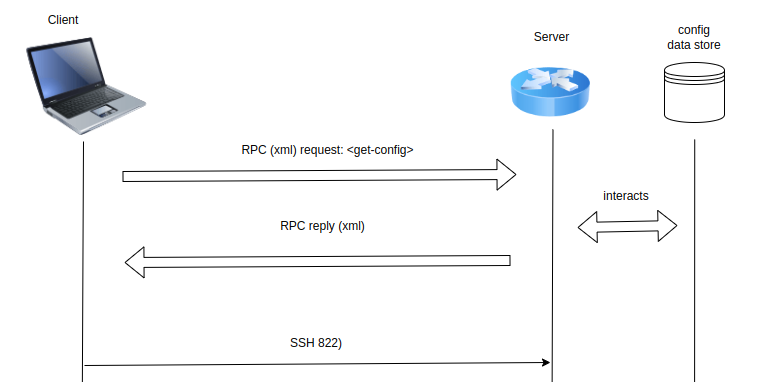

# Netconf

The Network Configuration Protocol (NETCONF) is an Internet Engineering Task Force (IETF) network management protocol that provides a secure mechanism for installing, manipulating and deleting the configuration data on a network device, such as a firewall, router or switch.

NETCONF was developed by the NETCONF working group and published in December 2006 as RFC 4741. The protocol was then revised in June 2011 and published as RFC 6241. This is the most current version. The IETF also published several other RFCs related to NETCONF. For example, RFC 5277 defines a mechanism for supporting an asynchronous message notification service for NETCONF.

The NETCONF protocol was designed to make up for the shortcomings of the Simple Network Management Protocol and the command-line interface scripting used to configure network devices.

## How does NETCONF work?

NETCONF uses the Remote Procedure Call (RPC) protocol to carry out communications between clients and servers. RPC is a client/server protocol that lets a program request a service from another program without understanding the details of the underlying network. RPC messages are encoded in Extensible Markup Language (XML) and transmitted via secure connection-oriented sessions.

A NETCONF client, which is often part of a network manager, can be a script or application. A server is usually a network device. RFC 6241 uses the terms client and application interchangeably and the terms server and device interchangeably.

<div align="center">
  
</div>

The client sends RFC messages that invoke operations on the server. The client can also subscribe to receive notifications from the server. The server executes the operations invoked by the client, and it can send notifications to the client.

A NETCONF server contains one or more configuration datastores. A configuration datastore is a datastore that holds all the configuration data needed to take a device from its default state to a configured operational state. A NETCONF datastore is simply a place to store and access configuration information. For example, the datastore might be a database, a set of files, a location in flash memory or any combination of these.

## Example usage

Sarah is a network engineer managing dozens of routers. She needs to update the configuration of all routers to add a new loopback interface for monitoring. Instead of logging in manually to each router and typing commands, Sarah uses NETCONF a protocol that lets her automate these changes using scripts or network management tools.

NETCONF allows Sarah to:
- Read and change device configurations in a structured (XML/YANG) way.
- Ensure changes are validated and consistent.
- Automate repetitive tasks across hundreds of devices, saving hours of manual work.

This will connect to the NETCONF subsystem over SSH and you’ll see the SR Linux device respond with its <hello> capabilities in XML.

```bash
echo -e '\n' | ssh -p 830 admin@172.20.20.2 -s netconf
```
```bash
<?xml version="1.0" encoding="UTF-8"?>
<hello xmlns="urn:ietf:params:xml:ns:netconf:base:1.0">
    <capabilities>
        <capability>urn:ietf:params:netconf:base:1.0</capability>
        <capability>urn:ietf:params:netconf:base:1.1</capability>
        <capability>urn:ietf:params:netconf:capability:candidate:1.0</capability>
        <capability>urn:ietf:params:netconf:capability:confirmed-commit:1.1</capability>
        <capability>urn:ietf:params:netconf:capability:rollback-on-error:1.0</capability>
        <capability>urn:ietf:params:netconf:capability:validate:1.0</capability>
        <capability>urn:ietf:params:netconf:capability:validate:1.1</capability>
        <capability>urn:ietf:params:netconf:capability:startup:1.0</capability>
        <capability>urn:ietf:params:netconf:capability:url:1.0?scheme=http,https,ftp,sftp,file</capability>
        <capability>urn:ietf:params:netconf:capability:with-defaults:1.0?basic-mode=explicit&amp;also-supported=report-all</capability>
```
