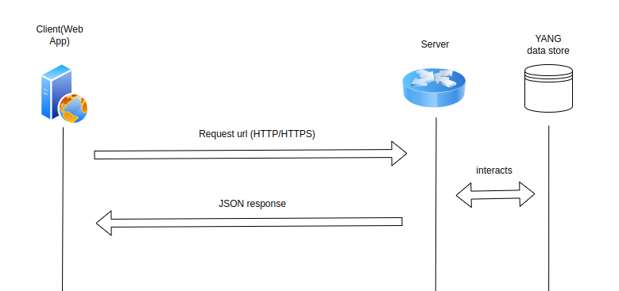

# RESTCONF

RESTCONF is an HTTP based protocol as defined in RFC 8040. RESTCONF standardizes a mechanism to allow Web applications to access the configuration data, state data, data-model-specific Remote Procedure Call (RPC) operations, and event notifications within a networking device.

RESTCONF uses HTTP methods to provide Create, Read, Update, Delete (CRUD) operations on a conceptual datastore containing YANG-defined data, which is compatible with a server that implements NETCONF datastores as defined in RFC 6241

Configuration data and state data are exposed as resources that can be retrieved with the GET method. Resources representing configuration data can be modified with the DELETE, PATCH, POST, and PUT methods. Data is encoded with either XML ( W3C.REC-xml-20081126) or JSON ( RFC 7951)

RESTCONF uses HTTP methods to provide CRUD operations on a conceptual datastore containing YANG-defined data, which is compatible with a server that implements NETCONF datastores.

## How does restconf works

 RESTCONF can be implemented on a device that supports the NETCONF protocol. Representational State Transfer Configuration (RESTCONF) is a standard protocol based on HTTP or HTTPS that provides a programmatic interface to access data defined in YANG, using the datastore concepts defined in the Network Configuration Protocol (NETCONF). YANG is a data modeling language that together with RESTCONF, provides the tools that network administrators need to automate configuration tasks across heterogenous devices in a software-defined network.

<div align="center">
  
</div>

The RESTCONF interface allows client applications to access and manipulate configuration data, state data, data-model-specific Remote Procedure Call (RPC) operations, and event notifications on a networking device, in a modular and extensible manner.

The API uses common HTTP operations such as GET, POST, PATCH, and DELETE, on a conceptual datastore containing YANG-defined data. Request and response messages can be in JSON format. The YANG data model explicitly and precisely determines the structure, syntax, and semantics of the data. The YANG modules are vendor-neutral and include models that are part of the OpenConfig project, standard IETF models, as well as some native models.

## Netconf vs RESTconf

| Feature       | NETCONF                       | RESTCONF                     |
| ------------- | ----------------------------- | ---------------------------- |
| Transport     | SSH (TCP 830)                 | HTTP/HTTPS (TCP 80/443)      |
| Encoding      | XML                           | JSON or XML                  |
| Operations    | RPC (get, edit, commit, etc.) | REST (GET, POST, PUT, etc.)  |
| Data Model    | YANG                          | YANG                         |
| Use Case      | Bulk, transactional config    | Simple, web API integration  |
| Tooling       | Custom clients, network tools | Browser, curl, scripts       |
| Ease of Use   | More complex                  | Easier, familiar to web devs |
| Notifications | Yes, robust                   | Yes, less advanced           |

## Example Usage

Alex manages a fleet of routers and needs to check interface status regularly. Instead of logging in via SSH each time, Alex uses RESTCONF, a protocol that lets him query and update device configuration securely with simple HTTP requests. This allows him to integrate network management with web tools and scripts easily.

Alex can use the following one-line `curl` command to get all interfaces from the Nokia SR Linux router:

```bash
curl -k -u admin:NokiaSrl1! \
  "https://172.20.20.2/restconf/data/srl_nokia-interfaces:interface"
```
```bash
<!doctype html>
<html lang=en>
<title>404 Not Found</title>
<h1>Not Found</h1>
<p>The requested URL was not found on the server. If you entered the URL manually please check your spelling and try again.</p>
```

Nokia SR Linux is designed to support modern, scalable network automation protocols such as gNMI and NETCONF, but not RESTCONF. This is by design, as these protocols offer more features for model-driven management and telemetry in large-scale, cloud-native networks.

