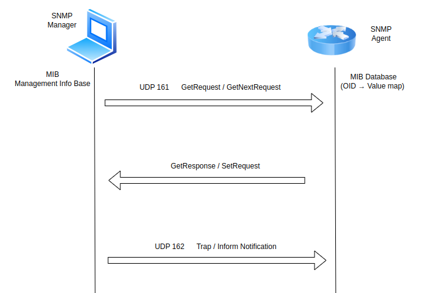

# SNMP

SNMP stands for "Simple Network Management Protocol." It’s an application layer protocol included in the internet protocol suite, a set of the most commonly used communication protocols online.

SNMP originated in the 1980s at the time when organizational networks were growing in both size and complexity. Today, it’s one of the most widely accepted protocols for network monitoring. Here’s a look at how SNMP works and why it matters to network professionals.

## What is the SNMP Protocol used for?

SNMP is used to collect data related to network changes or to determine the status of network-connected devices. Collecting this data can help IT professionals keep their finger on the pulse of all their managed devices and applications. Every device within the network can be queried in real time with SNMP, TCP, and other types of probes for their performance metrics. When thresholds for certain values are exceeded, software can alert system administrators of the issue, allowing them to drill into the data and troubleshoot a solution.

## How SNMP Works?

SNMP works by sending messages, called protocol data units (PDUs), to devices within your network that “speak” SNMP. These messages are called SNMP Get-Requests. Using these requests, network administrators can track virtually any data values they specify. All of the information SNMP tracks can be provided to a product that asks for it. That product can either display or store the data, depending on an administrator’s preferences.

| Command      | What it Does                              | Who Uses It     |
| ------------ | ----------------------------------------- | --------------- |
| **GET**      | Retrieve a value (e.g., CPU usage)        | Manager → Agent |
| **GET-NEXT** | Retrieve the next value in a list/table   | Manager → Agent |
| **SET**      | Change/set a value on the device          | Manager → Agent |
| **TRAP**     | Unsolicited alert/notification            | Agent → Manager |
| **INFORM**   | Like TRAP, but requires acknowledgment    | Agent → Manager |
| **GET-BULK** | Efficiently retrieve lots of data at once | Manager → Agent |

<div align="center">
  
</div>

## Example Usag:

1. **Manager GET**  
   The SNMP Manager polls the device by sending a **GetRequest** for an OID—e.g., the interface operational-status OID (`1.3.6.1.2.1.2.2.1.8.<ifIndex>`).

2. **Agent Response**  
   The SNMP Agent on the router processes the GetRequest and replies with a **GetResponse**, carrying the current value of that OID.

3. **Agent Trap**  
   If a critical event occurs—such as a link going down—the Agent immediately sends an unsolicited **Trap** PDU to the Manager (no polling required).  
   This allows real-time alerting for priority faults. :contentReference[oaicite:0]{index=0}

```bash
snmpwalk -v2c -c public 172.20.20.2 1.3.6.1.2.1.2.2.1.2     # list interfaces
snmpget  -v2c -c public 172.20.20.2 1.3.6.1.2.1.1.3.0       # uptime
```
```bash
iso.3.6.1.2.1.2.2.1.2.1851390 = STRING: "ethernet-1/57"
iso.3.6.1.2.1.2.2.1.2.1884158 = STRING: "ethernet-1/58"
iso.3.6.1.2.1.2.2.1.2.1077936129 = STRING: "mgmt0.0"
iso.3.6.1.2.1.2.2.1.2.1077952510 = STRING: "mgmt0"
iso.3.6.1.2.1.1.3.0 = Timeticks: (644400) 1:47:24.00
```
Those large numbers don’t imply thousands of ports they’re just the internal indices SR Linux assigns under the hood (often derived from hardware identifiers)

- OID .1.3.6.1.2.1.2.2.1.2 is the ifDescr object, which returns the human-readable name of an interface.

- The numeric suffix after that (e.g. 16382, 49150, …) is the ifIndex, a unique integer the agent uses internally to identify each interface instance.

- The value returned (STRING: "ethernet-1/1", etc.) is the interface’s configured name.

In short, SNMP remains one of the most widely adopted and vendor-agnostic protocols for monitoring and managing network devices. While newer, model-driven interfaces like NETCONF, RESTCONF, and gNMI provide richer data models and more automation-friendly APIs, SNMP’s simplicity, maturity, and broad support across legacy and modern equipment ensure it will remain a key part of network operations for years to come.

## Reference

[restconf](https://datatracker.ietf.org/doc/html/rfc1157)

