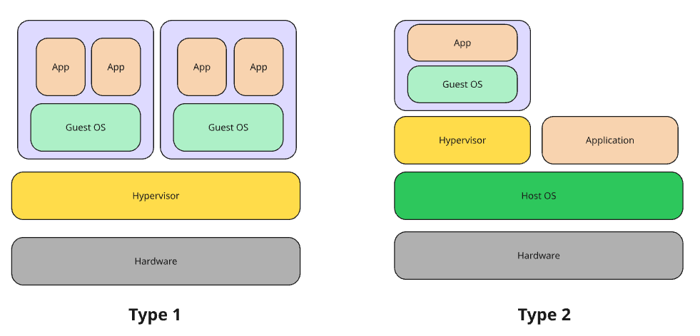

# Day 1: Virtualization Fundamentals

## What is Virtulization ?

Virtualization is a technology that enables the creation of virtual environments from a single physical machine, allowing for more efficient use of resources by distributing them across computing environments.

Think about it as dividing the actual hardware into virutal hardware which allows a more efficient way to use it completely.

Using software, virtualization creates an abstraction layer over computer hardware, dividing a single system’s components such as processors, memory, networks and storage into multiple virtual machines (VMs). Each VM runs its own operating system (OS) and behaves like a separate physical computer, despite sharing the same underlying hardware.

## Benefits & Use Cases  

Virtualization offers numerous benefits to both on-premises and cloud-based data centers that support IT operations, including the following:

- Resource efficiency
- Easier management
- Minimal downtime
- Faster provisioning
- Disaster recovery (DR)
- Cost-effectiveness

## Virtualization Components

Virtualization relies on several key components to create and manage virtual environments. Each plays a vital role in ensuring the effective allocation of resources so multiple VMs can run simultaneously without interference.

1. Physical machine (server/computer)
2. Virtual machine (VMs)
3. Hypervisor

### Physical machine (server/computer)

The physical machine, also referred to as the “host machine” is the hardware (e.g., server or computer) that provides CPU, memory, storage and network resources for the virtual machines.

### Virtual machine

A virtual machine (VM) is a virtual environment that simulates a physical computer in software form. VMs are usually referred to as guests, with one or more “guest” machines running on a host machine.

Virtual machines typically consist of several files, including the configuration, storage for the virtual hard drive and other dependencies. By sharing system resources among virtual machines, virtualization offers on-demand scalability, efficiency and cost savings.

### Hypervisor Types 

A hypervisor is the software layer that coordinates VMs. It serves as an interface between the VM and the underlying physical hardware, ensuring that each has access to the physical resources it needs to execute. It also makes sure that the VMs don’t interfere with each other by impinging on each other’s memory space or compute cycles.

 

There are two types of hypervisors:

1. Type 1 hypervisors: Type 1 or “bare-metal” hypervisors interact with the underlying physical resources, replacing the traditional operating system altogether. They most commonly appear in virtual server scenarios in which a software-based server is created by partitioning a physical server into smaller, self-contained segments, each capable of running its own operating system and applications.
2. Type 2 hypervisors: Type 2 hypervisors run as an application on an existing OS. Most commonly used on endpoint devices to run guest operating systems, they carry a performance overhead because they must use the host OS to access and coordinate the underlying hardware resources.

## Types of virtualization

Beyond server virtualization, many different types of IT infrastructure can be virtualized to deliver significant advantages to IT managers in particular and the enterprise as a whole. These types of virtualization include the following:

1. Desktop virtualization
2. Network virtualization
3. Storage virtualization
4. Data virtualization
5. Application virtualization
6. Data center virtualization
7. CPU virtualization
8. GPU virtualization
9. Linux virtualization
10. Cloud virtualization

## Virtualization marketplace solutions

Numerous companies offer specialized virtualization solutions tailored to different use cases, including server, desktop and application virtualization. Below are some of the most prominent solutions in the marketplace:

1. VMware: A leader in server, desktop, network and storage virtualization, VMware is renowned for its reliability and feature-rich tools. Its ESXi hypervisor, in particular, has been widely adopted in enterprise environments.
2. Oracle VirtualBox: Oracle VirtualBox is an open-source desktop virtualization platform, a popular choice for individuals and small businesses looking to run multiple operating systems on a single machine.
3. Citrix: Known for its strength in application virtualization, Citrix also offers server and virtual desktop solutions, providing a platform for organizations that need remote access and centralized app delivery.
3. Microsoft Hyper-V: Built into into Microsoft Windows, Hyper-V offers a cost-effective server and desktop virtualization product.
4. Red Hat Virtualization: Built on KVM, Red Hat Virtualization provides an enterprise-grade platform for server and desktop virtualization with a focus on open-source platforms.

## References

- [Virtualization Explained (IBM)](https://www.ibm.com/topics/virtualization)
- [Server Virtualization Overview (Microsoft)](https://learn.microsoft.com/en-us/windows-server/virtualization/hyper-v/hyper-v-technology-overview)
- [Desktop Virtualization (Citrix)](https://www.citrix.com/solutions/desktop-virtualization/)
- [Network Virtualization (VMware)](https://www.vmware.com/topics/glossary/content/network-virtualization.html)
- [VirtualBox Documentation (Oracle)](https://www.virtualbox.org/manual/ch01.html)
- [Red Hat Virtualization Product Page](https://www.redhat.com/en/technologies/virtualization/enterprise-virtualization)
