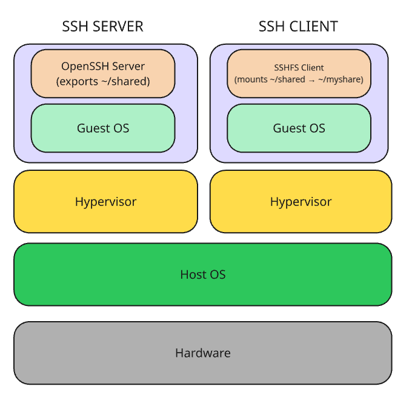

# Day 3: Virtual Networking & Storage

## What is virtual networking?

Lets see different exaplinations: 

- Virtual networking is the abstraction of network resources from the underlying physical network infrastructure. A virtual network is the logical representation of the physical hardware, such as the switches and routers, that makes up the infrastructure.

- Virtual networks reside on an abstraction layer, each with its own workloads and security. While the virtual networks are isolated from each other, they can broadcast messages to each other via the virtual overlay network without the messages having to pass through the underlying physical devices.

- Virtual networking uses the power of software to abstract network services from the underlying infrastructure and then connect network components in an overlay. Each network node is abstracted into a virtual entity. This abstraction enables network administrators to make configuration changes virtually without touching the physical devices.

### How does virtual networking work?

A network hypervisor abstracts the network’s physical layer from its control layer and admins can manage the network using only a software management tool.

Multiple networks can exist on the same physical network hardware. This is sometimes called a software-defined network (SDN). Individual network functions, such as firewalls, routers, and load balancers, can be implemented as virtual network functions (VNFs).

#### Virtual Switches & Port Groups

A **virtual switch (vSwitch)** acts like a physical Ethernet switch within the virtualization layer, connecting VMs on the same host and optionally bridging to external networks via physical NICs.

- **Isolated networks** use vSwitches/port groups with no physical NIC uplinks, limiting traffic to internal VM-to-VM communication.
- **Bridged networks** connect the vSwitch to physical NICs, allowing VMs to communicate with the wider LAN.
- **Port groups** are collections of virtual switch ports with shared configurations (e.g., VLAN ID, security settings), simplifying consistent networking for VMs.

---

#### VLAN Tagging & NIC Teaming

**VLAN Tagging**  
- VLANs logically segment network traffic on shared infrastructure.
- Assigning a VLAN ID to a port group or NIC ensures only tagged traffic is delivered, enabling isolation and multi-tenant setups.

**NIC Teaming**  
- Combines multiple physical network adapters into one logical link.
- Provides redundancy (failover), increased bandwidth, and load balancing.
- Policies can be set per port group or switch to define how traffic uses team members.

---

## What is virtual storage?

Virtual storage is a technology that abstracts physical storage resources—such as hard drives, SSDs, or entire storage arrays—across multiple devices and presents them as a single, unified storage pool. This pool can then be allocated to virtual machines, containers, or applications as needed, regardless of the underlying hardware.  
Virtual storage enables features like easier provisioning, thin or dynamic allocation, snapshots, cloning, and improved disaster recovery.

---

## How does virtual storage work?
Virtual storage operates by inserting a software layer (often called a **storage hypervisor** or **virtualization layer**) between physical storage devices and the consumers of storage (such as VMs or applications).  
- This layer aggregates and manages physical storage resources.
- It presents logical storage volumes or datastores to users and systems.
- Data written by VMs or applications is mapped to and from the actual physical storage, often supporting features like thin provisioning (allocating storage on demand), deduplication, replication, and snapshots.
- Administrators can move, resize, or clone storage volumes without directly manipulating the underlying physical hardware.

Virtual storage can be implemented at the **host level** (e.g., VMware vSphere’s VMFS or Microsoft Hyper-V’s VHDX), at the **network level** (e.g., SAN/NAS appliances), or via software-defined storage solutions.

---

#### Datastore Types

Datastores are logical containers that present physical or networked storage to virtual environments:

- **VMFS (VMware File System):** High-performance, cluster-aware file system for virtualization, enabling concurrent access from multiple hosts (SAN-backed).
- **NFS (Network File System):** Uses standard network shares; ESXi accesses VM files over IP from NAS devices.
- **iSCSI:** Delivers block storage over IP networks, making shared SAN features available via Ethernet.

---

## Hands-on with virtual network and storage.

This setup exemplifies virtual networking by using a Linux bridge (br0) and TAP interfaces as a purely software‐defined Ethernet switch both VMs attach to br0 via TAPs and can exchange packets just as if they were plugged into the same physical switch, yet completely isolated from your real network. It demonstrates virtual storage by having one VM export a directory over SSH (via the OpenSSH server) and the other VM mount that remote directory with SSHFS; although the “shared” folder lives on VM1’s disk, VM2 accesses it seamlessly over the virtual network as if it were local storage.

<div align="center">
  
</div>

###  Prepare the Host Bridge

1. Install bridge utilities which are required for for creating and managing Linux network bridges.

2. Create a Linux bridge

```bash
sudo ip link add name br0 type bridge
```

#### What is a bridge?

A software “switch” inside the host kernel. VMs or other interfaces attached to it can talk at Layer 2 (Ethernet) as if they were plugged into the same physical switch.

### Assign an IP to the bridge

```bash
sudo ip addr add 192.168.100.1/24 dev br0
```

#### Why assign an IP?

Allows the host itself to talk on that network (e.g. if you ever want to ping your VMs from the host).

```bash
sudo ip link set dev br0 up
```

### Create TAP Interfaces

TAP interfaces are virtual Ethernet endpoints in the host. Each one looks like a NIC to QEMU and attaches to the bridge.

```bash
for i in 0 1; do
  sudo ip tuntap add dev tap$i mode tap user $USER
  sudo ip link set dev tap$i up
  sudo ip link set dev tap$i master br0
done
```

ip tuntap add dev tap$i mode tap user $USER

tap$i → names tap0 and tap1.

mode tap → creates a Layer 2 endpoint (vs. mode tun for Layer 3).

user $USER → allows your user account permission to open/read/write the device.

### Launch Two Ubuntu VMs with QEMU

```bash
qemu-system-x86_64 \
  -name ssh-server \
  -m 1024 \
  -drive file=ubuntu-server1.img,format=qcow2 \
  -netdev tap,id=net0,ifname=tap0,script=no,downscript=no \
  -device virtio-net-pci,netdev=net0 \
  -enable-kvm \
  -nographic
```

```bash
qemu-system-x86_64 \
  -name ssh-client \
  -m 1024 \
  -drive file=ubuntu-server2.img,format=qcow2 \
  -netdev tap,id=net1,ifname=tap1,script=no,downscript=no \
  -device virtio-net-pci,netdev=net1 \
  -enable-kvm \
  -nographic
```

Identical, but using tap1 and a second disk image.

### Configure Static IPs Inside Each VM

VM1 (ssh-server):

```bash
network:
  version: 2
  ethernets:
    eth0:
      dhcp4: no
      addresses:
        - 192.168.100.10/24
```

VM2 (ssh-client):

```bash
network:
  version: 2
  ethernets:
    eth0:
      dhcp4: no
      addresses:
        - 192.168.100.11/24
```

Apply the netplsn

```bash
sudo netplan apply
```

### Set Up the SSH File Server (VM1)

On ssh-server (192.168.100.10):

```bash
sudo apt update
sudo apt install -y openssh-server
mkdir -p ~/shared
chmod 755 ~/shared
sudo systemctl enable --now ssh
```

openssh-server → runs sshd, listening on port 22.

Creates a ~/shared directory with world-read/write permission (for demo).

Enables and starts the SSH daemon so VM2 can connect.

### Mount the Share via SSHFS (VM2)

```bash
sudo apt update
sudo apt install -y sshfs
mkdir ~/myshare
sshfs $USER@192.168.100.10:~/shared ~/myshare
```
sshfs → FUSE-based client that mounts a remote directory over SSH.
sshfs user@host:remote_path local_mountpoint
Prompts for your SSH password and then makes ~/myshare behave like the server’s ~/shared.

## References

- [VMware vSphere Networking Documentation](https://docs.vmware.com/en/VMware-vSphere/8.0/vsphere-networking/index.html)
- [VMware vSphere Storage Documentation](https://docs.vmware.com/en/VMware-vSphere/8.0/vsphere-storage/index.html)
- [Virtual Switches](https://docs.vmware.com/en/VMware-vSphere/8.0/vsphere-networking/GUID-5113B271-5A4B-4A9D-A4A9-345B0545C107.html)
- [Port Groups](https://docs.vmware.com/en/VMware-vSphere/8.0/vsphere-networking/GUID-3C6CE6F3-262B-486B-9EA0-5D11F234E5C1.html)
- [VLAN Tagging](https://docs.vmware.com/en/VMware-vSphere/8.0/vsphere-networking/GUID-6E939C73-095B-465A-A94D-7B4C42A0A6A0.html)
- [NIC Teaming](https://docs.vmware.com/en/VMware-vSphere/8.0/vsphere-networking/GUID-E8D6A902-2A24-4C62-B27A-EA3A4C56D92B.html)
- [Datastores & VMFS/NFS/iSCSI](https://docs.vmware.com/en/VMware-vSphere/8.0/vsphere-storage/GUID-5D1A49A6-6B10-4B8D-B8C8-4FE7BCE750A4.html)
- [IBM: Storage Virtualization Explained](https://www.ibm.com/topics/storage-virtualization)